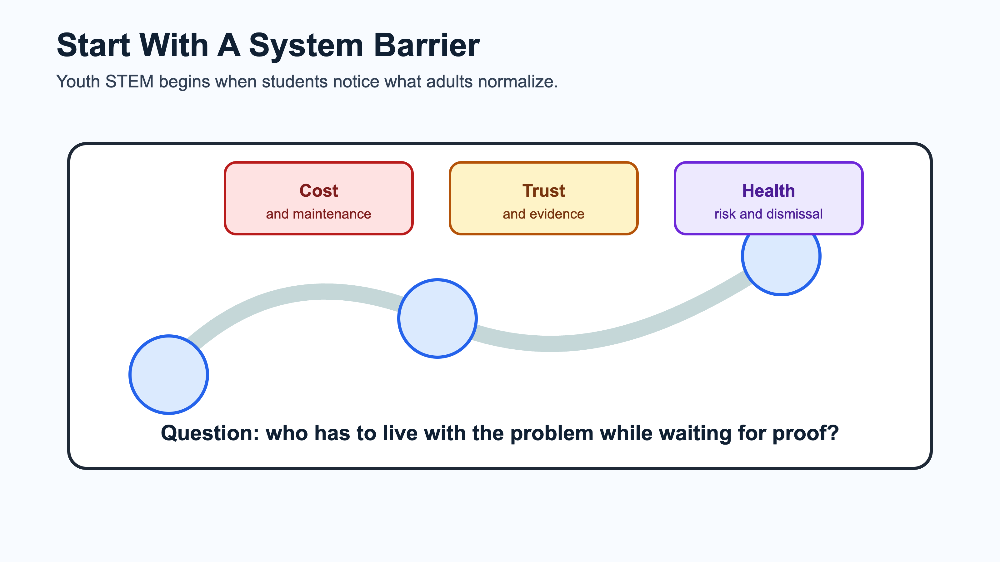
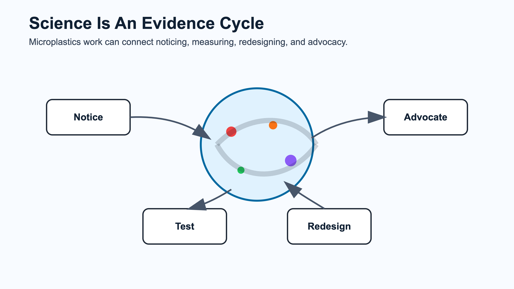
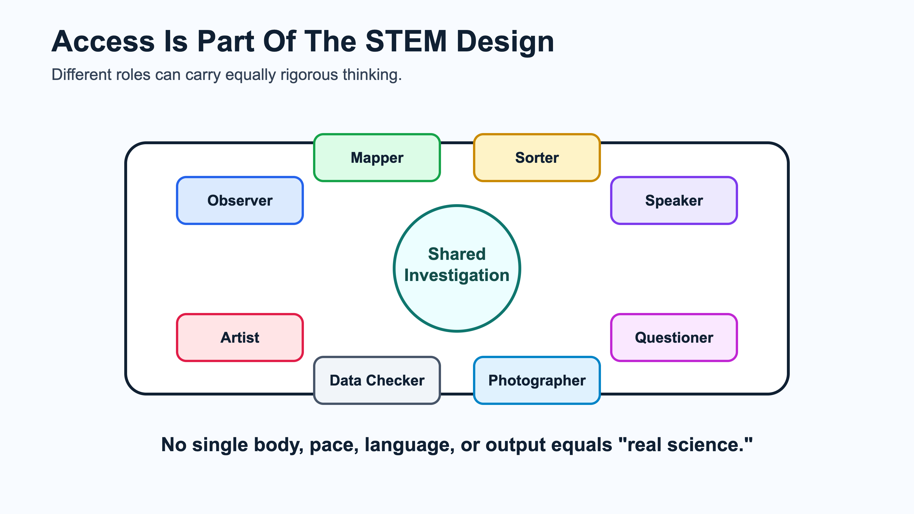
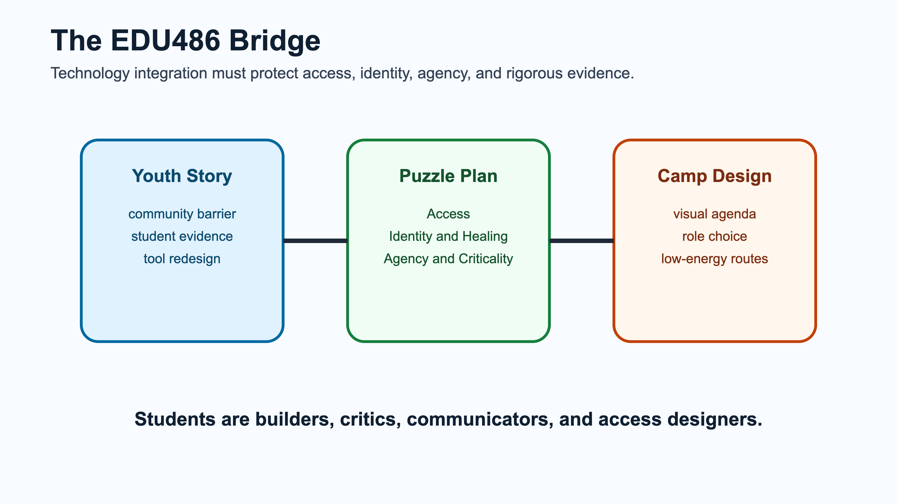

# Task 3 - Youth STEM Story Share

## Requirement

Find and read a story about a young person or group of young people using STEM to make a positive contribution to their community. Prepare a 5-minute share about what was inspiring and intriguing, and consider how science, technology, and community interacted. Create image-only slide(s) and send them to April by June 29.

Email target from announcement: `april.luehmann@rochester.edu`

Public deck:

- [access-to-agency-youth-stem-story.pptx](../../public-submissions/access-to-agency-youth-stem-story.pptx)
- [slide 1](../../public-artifacts/youth-stem-access-slide-1.png)
- [slide 2](../../public-artifacts/youth-stem-access-slide-2.png)
- [slide 3](../../public-artifacts/youth-stem-access-slide-3.png)
- [slide 4](../../public-artifacts/youth-stem-access-slide-4.png)

Public DOCX export:

- [task3-youth-stem-story-mia-heller.docx](../../public-submissions/task3-youth-stem-story-mia-heller.docx)

Image deck source note:

- Story source: [Smithsonian Magazine: This High School Student Invented a Filter That Eliminates 96 Percent of Microplastics From Drinking Water](https://www.smithsonianmag.com/innovation/this-high-school-student-invented-a-filter-that-eliminates-96-percent-of-microplastics-from-drinking-water-180988363/).
- The first recovered deck has been replaced for the public repo with original access-centered slide images so the presentation is clickable and not dependent on third-party article media.

## Chosen Story

Story: Mia Heller, a high school student in Virginia, invented a water filtration system that removes about 95.5% of microplastics from drinking water using ferrofluid and magnetic separation.

Primary source used:

[Smithsonian Magazine: This High School Student Invented a Filter That Eliminates 96 Percent of Microplastics From Drinking Water](https://www.smithsonianmag.com/innovation/this-high-school-student-invented-a-filter-that-eliminates-96-percent-of-microplastics-from-drinking-water-180988363/)

## Why This Story Fits EDU486

This story connects directly to the Planet Protectors / plastics pollution thread in the course. It shows a young person using science and technology in response to a local community problem: water contamination and limited public funding for filtration.

The access-centered reason it fits EDU486 is that the invention began from a mismatch between a community need and the tools available to families. I do not want to present Mia Heller only as an individual genius story. I want to use the story to ask what happens when students notice a real barrier, build evidence, test tools, and redesign the system instead of accepting that the current system is all that is possible.

That connects to my course focus on neurodivergent, chronically ill, disabled, CLD, multilingual, and multiply marginalized students. In camp, the STEM challenge is not only "Can students learn about microplastics?" It is also "Can the learning environment make room for different bodies, energy levels, languages, sensory needs, communication styles, and evidence practices while keeping the science rigorous?"

## 5-Minute Speaking Plan

### 0:00-0:45 - Brief Overview

Mia Heller read about water quality problems in her Warrenton, Virginia community, including PFAS and microplastic contamination. When public funding was not available to solve the filtering problem, she began designing a lower-maintenance home filtration system. I would frame this as a young person refusing to treat an under-addressed community problem as normal.

### 0:45-1:45 - Science

The science problem is that microplastics are tiny, widespread, and hard to remove. Heller used ferrofluid, a magnetic oil, because it can bind to microplastic particles. A magnetic field can then pull the ferrofluid-bound particles out of the water.

### 1:45-2:45 - Technology

The technology is not just a filter. It is a system: contaminated water, ferrofluid, magnetic separation, recovery/reuse of the ferrofluid, and a turbidity sensor to measure how much material remains. Her prototype reportedly removed 95.52% of microplastics and recycled 87.15% of the ferrofluid.

### 2:45-3:45 - Community

What inspires me is that the project began with a community access problem. Heller was not solving an abstract lab puzzle. She was responding to a situation where families were expected to handle filtration on their own, and existing systems were expensive and maintenance-heavy. That matters for justice-centered STEM because access is not a side issue. Cost, maintenance, trust, language, health risk, and who is expected to do the labor all shape whether a technology is actually usable.

### 3:45-4:45 - Connection to Camp

For Freedom Scholars, this story can help students see that environmental STEM starts with noticing. A student noticed a problem, asked why existing tools were not enough, tested alternatives, and created evidence. That is a powerful model for Planet Protectors: youth can investigate problems that adults normalize or underfund.

For my EDU486 work, I would add an access question: How do we design the camp investigation so students can participate through multiple roles, energy levels, languages, and communication modes? A student should be able to be a mapper, photographer, sorter, observer, question-asker, artist, data checker, or speaker without one role being treated as the only "real" science.

### 4:45-5:00 - Closing Question

The question I would bring back to class is: How can we design camp activities where technology helps students turn local environmental noticing into evidence and action while protecting bodymind access, identity, language, and agency?

## Inspiring / Intriguing Points

- The project started from local water concerns, not just a contest prompt.
- The technology tries to reduce maintenance and waste, not only increase filtering power.
- The system includes testing, iteration, and measurement.
- It raises justice questions: who gets clean water, who pays for filtration, whose health risks are believed, and whose community problems get treated as urgent?
- It helps me teach STEM as redesign: when a tool does not fit the people who need it, students can question the tool, not blame the people.

## Access-Centered Slide Talk Notes For New Public Deck

Because the required slides are image-only, these are the speaking notes I would keep beside the deck:

- Slide 1: Start with a system barrier. The story matters because a young person noticed that families were being left to manage water-quality risk through expensive, maintenance-heavy tools.
- Slide 2: Science is an evidence cycle. Students can move from noticing, to testing, to redesigning, to advocacy.
- Slide 3: Access is part of the STEM design. A student can contribute as observer, mapper, sorter, speaker, artist, data checker, photographer, or questioner.
- Slide 4: The EDU486 bridge. The story should connect youth STEM to Puzzle Plan / EQUITAS commitments: access, identity, healing, agency, criticality, joy, and transformation.

## AI Use Disclosure

OpenAI Codex was used on July 1, 2026 to rebuild the speaking plan around the Puzzle Plan / EQUITAS foundation and generate an original, public, image-only PowerPoint deck.

## Email Draft

Subject: EDU486 youth STEM story slides - Piter Garcia

Hi April,

I am sending my image-only slides for the youth STEM story share. I chose Mia Heller's microplastics filtration project because it connects youth invention, water quality, magnetic/ferrofluid technology, community access, and the question of how young people can redesign tools when existing systems do not fit community needs.

Best,
Piter
