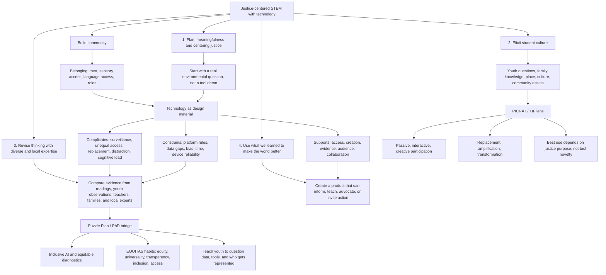

# Visualizing Our Grounding Frameworks - Part 1

Student: Piter Z. Garcia Bautista
Course: EDU486 - Integrating Science and Technology
Working title: Community Evidence, Technology, and Justice-Centered STEM
Due: July 14, 2026

## Submission Focus

This visualization represents my current understanding of the JuST Framework and the role technology can play in justice-centered STEM learning. My central claim is that technology is not automatically liberating or harmful. It becomes meaningful when it helps youth, families, and communities ask stronger questions, collect and interpret evidence, create new representations, and act on what they learn.

## Visualization

The image above is the submit-ready visual. The Mermaid version below is included so the structure can be revised quickly inside GitHub as my thinking changes.

Direct links:

- [Grounding framework visual SVG](grounding-frameworks-visual.svg)
- [Grounding framework visual PNG export](</Users/pitergarcia/DataScience/Semester4(UofR)/EDU486/submission_exports/grounding-frameworks-visual.png>)
- [Grounding frameworks Part 1 DOCX export](</Users/pitergarcia/DataScience/Semester4(UofR)/EDU486/submission_exports/grounding-frameworks-part1.docx>)
- [Module 1 source map](../../docs/source-map.md#module-1-local-sources)

## Annotations

**Community before tool.** The first move in justice-centered STEM is not choosing an app. It is building the conditions where students can safely bring questions, language, sensory needs, family knowledge, and local experience into the work.

**Technology has affordances and risks.** A digital map, microscope camera, AI summary, spreadsheet, or slideshow can help students see patterns and reach audiences. The same tools can also create barriers through surveillance, inaccessible interfaces, inaccurate outputs, unequal access, or too many steps held in working memory.

**PICRAT helps me ask what students are actually doing.** A tool that only replaces a worksheet might still improve access, but it should not be treated as transformation. In this course, I want technology to move students toward interactive and creative participation when that deepens learning and agency.

**JuST helps me keep the moral center visible.** The framework pushes me to plan for meaningfulness, elicit student culture, revise with diverse expertise, and use learning for action. That cycle keeps STEM from becoming disconnected facts or tool practice.

**My Puzzle Plan connection is evidence justice.** My broader work on equitable diagnostics and inclusive AI keeps asking: whose data counts, whose patterns are missed, and who is harmed when systems appear neutral? In EDU486, I can translate that question into a youth-accessible STEM practice: students can learn to collect, question, and communicate evidence without losing community knowledge.

## Example For Planet Protectors Camp

If our camp theme centers microplastics or water quality, a justice-centered technology activity could ask students to investigate how plastic pollution is noticed, measured, and communicated.

- Youth knowledge: Where do we see plastic waste? What places do adults ignore? What does our community already do to protect water, parks, streets, or homes?
- STEM evidence: Students observe, sort, count, photograph, map, or model plastic pollution patterns.
- Technology support: A shared map, spreadsheet, phone/microscope image, or simple data visualization helps students create evidence.
- Technology caution: The tool should not replace direct observation or local stories. Students should be able to explain what the data does not show.
- Action: Students create a poster, mini-report, demonstration, or family/community message about what they learned and what should change.

## Brief Reflection

At this point in the course, I understand the JuST Framework as a cycle of relationship, inquiry, revision, and action. It asks me to make STEM learning accountable to students and communities rather than only to content coverage. Technology belongs in that cycle when it expands participation, helps students make meaning, or supports action. It becomes a problem when it narrows the work to screen time, surveillance, or polished products without community purpose.

For my own teaching, the most important tension is that technology can both reveal and hide injustice. A data tool can make pollution patterns visible, but it can also make students trust numbers more than people. AI can help me explore a topic quickly, but it can also flatten local experience or produce confident but incomplete explanations. A justice-centered teacher has to design routines where students ask who made the tool, what evidence it includes, what it leaves out, and how the work can help people.

My working commitment is to design technology-supported STEM where youth are not just users. They are observers, questioners, builders, critics, and communicators. That is the connection I want to carry into the camp plan and later revise in Part 2 after I have evidence from actual teaching.

## AI Use Disclosure

OpenAI Codex (GPT-5) was used on July 1, 2026 to synthesize course materials, organize assignment requirements, and draft an initial version of this artifact. I reviewed, revised, and am responsible for the final content, examples, and submission decisions.
