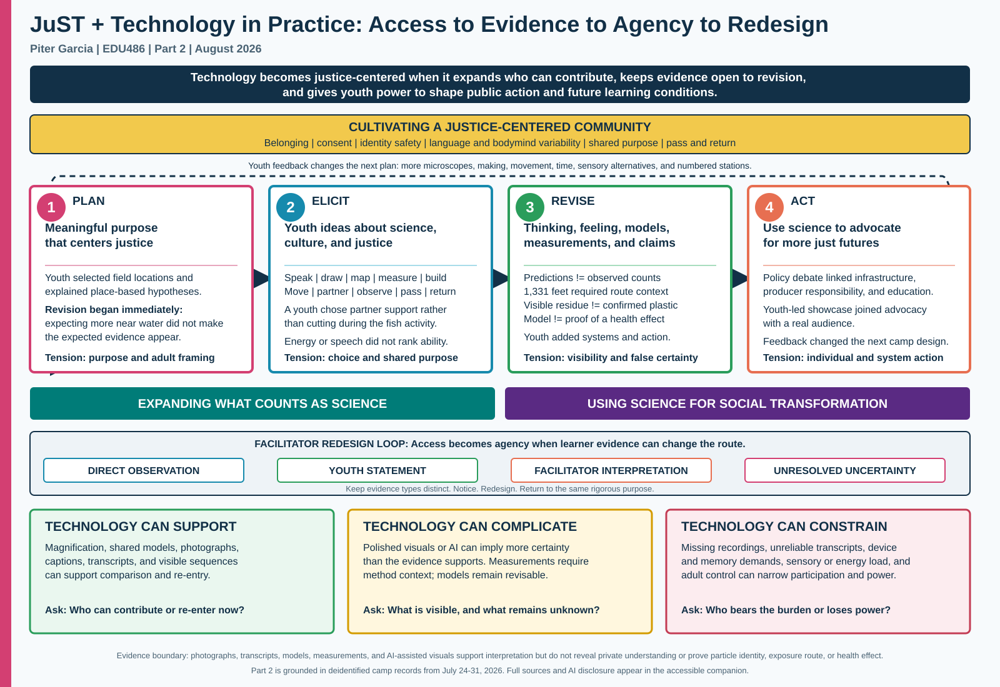

# Visualizing Our Grounding Frameworks - Part 2

**Student:** Piter Z. Garcia Bautista

**Course:** EDU486 - Integrating Technology in STEM

**Due:** August 8, 2026

**Title:** JuST + Technology in Practice: Access to Evidence to Agency to Redesign

## Revised Visualization

**Short alt text:** A justice-centered community anchors a Plan-Elicit-Revise-Act
cycle. Youth feedback returns to planning, a facilitator redesign loop keeps
four evidence types distinct, and three technology lenses show support,
complication, and constraint.

## Central Claim

Technology becomes justice-centered when it expands who can contribute, keeps
evidence open to revision, and gives youth power to shape both public action
and future learning conditions.

## What Changed From Part 1

In Part 1, I argued that technology is never a neutral add-on and that access
must be designed before selecting a tool. Camp reinforced that claim, but it
changed what I mean by agency. I had mainly described multiple participation
routes as ways for youth to reach a shared, adult-designed goal. During
Invisible Invaders, youth words and actions became evidence that should also
change the route. Youth could name low energy without being treated as
incapable, choose a different role in a sensory activity, and recommend more
microscope time, construction, movement, less rushing, and a numbered showcase
sequence. I now understand access as incomplete unless youth can influence
future learning conditions.

The revised visual therefore adds a return arrow from action to planning and a
facilitator redesign loop. Direct observation, youth statements, facilitator
interpretation, and unresolved uncertainty remain parallel evidence types.
This prevents a photograph, silence, posture, an adult prompt, or a polished
artifact from being treated as proof of what a learner understood or felt.

## Technology In Practice

Technology helped when it made continuity and evidence more shareable.
Magnification, measuring wheels, shared models, visual recaps, photographs, and
transcripts helped participants notice, compare, explain, and return after a
pause. Each tool also required an evidence boundary. Magnified residue was not
chemical identification. A distance value required interpretation of the
route. A model did not prove a health effect. Photographs did not reveal
private understanding, and the absence of a Day 5 video limits what I can claim
about that session.

The JuST cycle became concrete through practice. Youth formed place-based
hypotheses, contributed through maps, tools, movement, speech, observation,
art, and partnership, revised models and measurements, debated responsibility,
and taught families. The policy work moved beyond individual littering toward
infrastructure, producer responsibility, education, and capture systems.
Aastha and I pursued one rigorous shared question while adjusting the routes
through which youth could participate.

## Practical Commitments

Going forward, I will:

1. protect multiple participation routes while keeping a common rigorous
   scientific purpose;
2. preview sensory demands and offer an equal non-fish route rather than
   treating equipment as consent;
3. plan fewer essential activities so youth have more time to build, use
   microscopes, move, and revise;
4. teach the distinctions among observation, estimate, measurement, model,
   inference, and confirmation;
5. connect environmental action to infrastructure, policy, production, and
   unequal burdens rather than only individual behavior; and
6. end with open, multimodal feedback that can change the next plan.

Justice-centered STEM learning with technology is not a polished product. It
is a revisable relationship among community, evidence, power, and action.

## Evidence Ledger

| Camp evidence | What it changed in the visual |
|---|---|
| A youth predicted more plastic near the water, then reported not seeing what was expected. | A hypothesis is revisable; prediction is not a result. |
| Initial estimates, visual counts, and magnified observations differed. | Technology changes what can be noticed, but visibility is not confirmation. |
| A youth chose partner support instead of cutting during the fish activity. | Participation choice and consent belong inside the community core. |
| The measuring-wheel route doubled back before the distance was corrected. | Numerical evidence requires method context and revision. |
| Policy reasoning combined infrastructure, producer responsibility, and education. | Action should address systems and shared responsibility, not only individual blame. |
| Youth taught visitors, then requested more microscope time, making, movement, less rushing, sensory alternatives, and numbered stations. | Youth feedback must return to planning and change future conditions. |

## Evidence And Privacy Boundaries

- Anonymous speaker labels are activity-specific and do not identify a child
  across days.
- Photographs show visible participation and artifacts, not private
  understanding, emotion, motivation, disability, or identity.
- Visible litter, retained sand particles, and tire residue were not always
  chemically confirmed as plastic.
- `51+` refers to visible litter observations along approximately 406 meters,
  not confirmed plastic particles or a complete pollution survey.
- Models supported explanation and revision; they did not prove a human
  exposure route or health effect.
- Day 5 has 10 photographs and a same-session transcript, but no source video.
- Adult prompts shaped the retrospective; silence is not agreement, and a
  prompted empowerment question is not independent evidence of empowerment.
- AI-assisted visuals clarify communication but do not replace original
  photographs, recordings, artifacts, or transcripts.

## Direct Sources

- [Luehmann et al., *Toward a Justice-Centered Ambitious Teaching Framework*](https://doi.org/10.1002/tea.21917)
- [Ambitious Science Teaching interview about the JuST Framework](https://ambitiousscienceteaching.org/the-just-framework-an-interview-with-dr-april-luehmann/)
- [CAST Universal Design for Learning Guidelines 3.0](https://udlguidelines.cast.org/)
- [Day 1 - Field Investigation](../../transcripts/camp-clean/2026-07-24-day1-field-investigation.md)
- [Day 2 - Air, Neighborhood, Fish, and Model](../../transcripts/camp-clean/2026-07-27-day2-air-neighborhood-fish-model.md)
- [Day 3 - Separation, Measurement, Friction, Scientist, and Identity](../../transcripts/camp-clean/2026-07-28-day3-separation-measurement-friction-scientist-identity.md)
- [Day 4 - Model, Policy, and Advocacy](../../transcripts/camp-clean/2026-07-29-day4-model-policy-advocacy.md)
- [Day 5 - Youth-Led Showcase](../../transcripts/camp-clean/2026-07-30-day5-youth-led-showcase.md)
- [Day 6 - Youth Retrospective and Future Design](../../transcripts/camp-clean/2026-07-31-day6-youth-retrospective.md)

## AI Use Disclosure

I used OpenAI Codex under my supervision in August 2026 to synthesize the
assignment requirements, my Part 1 artifact, deidentified camp transcripts,
evidence documentation, and poster findings; organize the revised
visualization; draft accessible companion text; and check claims against their
sources. AI also supported clarification, labeling, and accessibility in some
camp recap visuals, but those visuals remain communication artifacts rather
than replacements for original evidence. AI did not identify youth, infer
diagnoses or internal states, or replace the contributions of Aastha, the
youth, or the camp community. I reviewed the evidence and remain responsible
for the privacy, science, interpretation, wording, and final submission.
