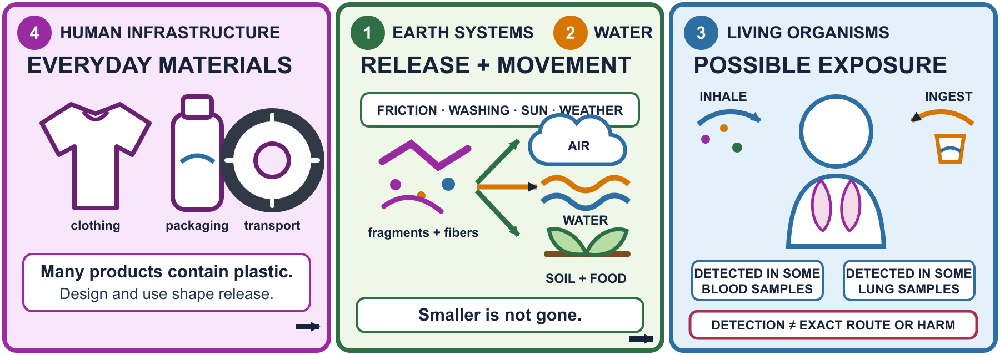

# Invisible Invaders - Friday Anchoring Phenomenon Routine

**Field Friday facilitator guide:** July 24, 2026 | Charlotte Beach | 10-12 minutes per rotation

**Team:** Piter Garcia and Aastha

**Editable Google Doc:** [Invisible Invaders - Friday Anchoring Phenomenon Routine - July 24](https://docs.google.com/document/d/16iqraS0TefwyGQdTOlp2s-sQnIWB6DgCOptWtB8vWJ0/edit)

## Start Here

### Anchoring phenomenon

> **Humans aren't trash cans, but we have plastics in our bodies.**

### Driving question

> **How does plastic break into tiny pieces, move through the environment and into living bodies, and how can we stop it fairly?**

### Field Friday connecting question

> **Gotta-Have 1 - Earth systems are interconnected:** How can plastic move among or collect in sand, water, air, living things, and human systems even when we do not notice it at first?

### Purpose

**Campers compare what they can see with a known count in a controlled model, then use that experience to ask what evidence a real beach investigation would require.** The four jars are adult-built models, not Charlotte Beach samples or evidence about any neighborhood. By the end, campers should distinguish an observation from an estimate or inference, identify one limitation of the model, and contribute one question through a sustainable participation route.

### Color And Word Key

- **Gotta-Have colors:** Earth systems = green | Water = orange | Living organisms = blue | Human infrastructure = magenta.
- **Function tags:** [SCIENCE] = causal mechanism | [EVIDENCE] = observation, source, or uncertainty | [JUSTICE/ACTION] = power, burden, or change | [ACCESS] = a rigorous participation route.

## How We Use The Source Template

**We keep the template's useful learning sequence: evidence before explanation, reveal what the evidence can show, name the larger mystery, leave a real question open, and transition into investigation.** We do not use a crime-scene performance, a fake beach sample, a scary body fact, a bare-hand safety test, planted litter presented as a discovery, or a prediction that one source must be the answer. Curiosity comes from an honest mismatch between the first visible estimate and a known controlled count.

## Before Campers Arrive

### Build And Pilot The Four Jars

Use four clear containers labeled **MODEL A-D**. Put the same amount of clean, dry sand in each jar and use clean, visible plastic proxy pieces that are large enough to retrieve. These are model pieces, not collected microplastics.

- **MODEL A:** 4 visible + 4 hidden = 8 total.
- **MODEL B:** 2 visible + 10 hidden = 12 total.
- **MODEL C:** 6 visible + 2 hidden = 8 total.
- **MODEL D:** 1 visible + 5 hidden = 6 total.

**Pilot the jars once, photograph each final arrangement, and prepare a matching facilitator count card.** Keep the arrangement and totals identical across all rotations. Jar B should make the central pattern possible: what looks like less at first may contain more in the controlled model.

### Materials

- Four sealed MODEL A-D jars, count cards, and one clean containment tray.
- Hand lenses or one phone macro camera, plus printed close-up images as a no-device route.
- A-D response cards, estimate slips, pencils, clipboards, and a visible timer.
- A visual agenda: **LOOK -> ESTIMATE -> REVEAL -> QUESTION -> SAMPLE**.
- Role cards: observer, card chooser, recorder, photographer, timer, materials monitor, or seated coordinator.
- Large anchor, driving-question, and Gotta-Have 1 cards.
- Question cards or sticky notes for the Monday question board.
- A photo or printout of the current before/during/after sample model.
- Hand-cleaning supplies and a separate bin for the controlled model materials.

### Keep Model And Field Evidence Separate

**Never mix the controlled MODEL A-D materials with Charlotte Beach Site A-F samples.** A designated model jar may be opened only over the clean tray. If wind, time, sensory needs, or mobility make opening the jar impractical, use its photo and known-count card. The field samples remain sealed, labeled, traceable, and separate.

### Co-Teaching Roles

- **Piter:** previews the routine, launches one prompt at a time, names the evidence boundary, and makes the anchor and driving question visible.
- **Aastha:** manages A-D cards and materials, offers participation choices, records campers' exact words, and gives the two-minute transition warning.
- **Both:** notice access needs, protect wait time, avoid answering the week's question for campers, and switch roles between rotations if mutually useful.

## The 10-12 Minute Routine

### Part 1 - Access Preview (0:00-1:00)

**Show the whole sequence before asking campers to begin.**

**SAY:** "We will look, estimate, compare with a known answer, leave one question, and then collect a real sand sample. You may point, draw, speak, write, photograph, work with a partner, use your home language, or pass. Touching a jar is optional."

Offer a seated or quiet position, a touch-free role, and the A-D cards. Pair every color with a word and letter. Do not cold-call or require a public explanation.

### Part 2 - Cold Open: Evidence Before Explanation (1:00-4:00)

**Place MODEL A-D together on the tray and identify them honestly as models that the team built.**

**SAY:** "Before we collect beach sand, we built four model jars. We know exactly how many clean plastic pieces are inside. Which jar looks like it contains the most plastic? What do you notice that makes you say that?"

Give quiet observation time before discussion. Campers choose A-D or record a number. Ask, "What did you observe?" and "What did you infer from what you saw?" Record their words without correcting the estimate.

### Part 3 - Reveal: Compare Estimate With Known Count (4:00-7:00)

**Reveal the count cards and, when practical, open one camper-selected model jar over the tray.**

**SAY:** "Our first answer was an estimate based on what was visible. This is the known count because we built the model. What changed in your thinking? What was difficult to see?"

Make the limit explicit:

> **[EVIDENCE] The model shows that visible appearance can hide material. It does not tell us how much plastic is in Charlotte Beach sand, where a particle came from, or whether something we see outdoors is chemically confirmed plastic.**

Ask, "What evidence or method would we need for a real beach sample?" Use responses to bridge into consistent site labels, amounts, depths, tools, field blanks, and contamination notes.

### Part 4 - Name The Larger Mystery (7:00-9:30)

**Give a brief content preview before mentioning human samples.**

**SAY:** "The next sentence mentions plastic detected in some human samples. You may use the environment-only evidence card, move farther away, or ask a partner to read it. Every route answers the same science question."

Reveal the anchor:

> **Humans aren't trash cans, but we have plastics in our bodies.**

**SAY:** "Researchers detected plastic particles in some blood and lung-tissue samples. That is evidence of presence in those samples. It does not identify every source or route, show that every person has the same exposure, or prove a particular health effect."

Reveal the driving question and Friday's green Gotta-Have 1 question. Show the current sample-model visual as a preview, not a completed answer.

### Part 5 - Cliffhanger Close And Sampling Bridge (9:30-12:00)

**Each camper contributes or chooses one question; no camper must disclose anything about their own body or health.**

Offer one prompt at a time:

- What might a first look miss?
- How could plastic move among sand, water, air, living things, and human systems?
- What evidence would we need before calling an outdoor particle plastic?
- Where could a fair system change interrupt the pathway?

Campers may write, draw, point to a prompt, dictate, record audio, use a partner, or pass. Save their exact question for Monday.

**CLOSING LINE:** "The jars had a known answer because we built them. The beach does not. Now we will use the same sampling method and careful labels so our evidence can be compared. We are leaving with a question, not pretending we already know the answer."

## Transition Into Systematic Sand Sampling

**Move directly from the controlled model to the Field Friday sampling protocol.** Use the same depth, amount, container process, site ID, map position, time, weather record, and contamination notes at each assigned site. A visual observation may justify the label **suspected particle**; it does not justify **confirmed microplastic** without appropriate identification.

## Evidence, Justice, And Access Guardrails

### What We Can Claim

- **[EVIDENCE]** Campers' first visible estimates may differ from the controlled known counts.
- **[SCIENCE]** Sand can hide material from a first visual inspection.
- **[EVIDENCE]** A consistent sampling method makes comparisons more defensible.
- **[SCIENCE]** Plastic can become smaller and move through connected Earth and human systems.
- **[JUSTICE/ACTION]** Product and infrastructure decisions shape release, movement, monitoring, prevention, and cleanup.

### What We Cannot Claim From This Routine

- The model jars represent the amount of plastic at Charlotte Beach or in any neighborhood.
- A visible field particle is chemically confirmed plastic.
- One observed particle's exact source, travel route, or health effect is known.
- Detection in selected human samples proves the same exposure or effect for everyone.
- Young people or families are individually responsible for systems they do not control.

### Access Is Part Of The Science

**The rigorous goal is to observe, compare, name uncertainty, and ask a testable or investigable question.** Campers can reach it by looking, pointing, drawing, choosing a card, speaking, writing, photographing, dictating, recording, using home language, working with a partner, or passing and re-entering later. Provide a visible agenda, one instruction at a time, transition warnings, low-energy and seated roles, quiet space, touch-free routes, and an environment-only alternative to body-related evidence.

## Facilitator Responses

- **If a camper asks, "Is this beach sand?"** Say: "No. These are controlled models we built. The real samples are the ones we will collect and label next."
- **If a camper says, "That piece is microplastic."** Say: "It may be a suspected particle. What evidence would confirm what material it is?"
- **If a camper asks, "Is plastic hurting my body?"** Say: "The evidence we are using shows detection in some samples. Scientists are still studying routes and effects, so we will not claim more than the evidence shows."
- **If uncertainty causes anxiety:** show what is known, what remains open, and what happens next. Do not promise that every scientific question will be resolved by Friday.
- **If time or energy drops:** protect the reveal, evidence boundary, anchor, and one youth question. Reduce repetition, not access.

## Seven-Minute Backup

1. **1 minute:** show LOOK -> ESTIMATE -> REVEAL -> QUESTION -> SAMPLE and participation routes.
2. **2 minutes:** campers inspect MODEL A-D and choose an estimate.
3. **2 minutes:** reveal known counts and name what the controlled model can and cannot show.
4. **1 minute:** reveal the anchor, evidence boundary, and driving question.
5. **1 minute:** collect one question and transition to systematic sampling.

Use photo/count cards instead of opening a jar when the weather, site, schedule, or camper needs require it.

## After Each Rotation

- Save estimates, exact youth questions, and one observation-versus-inference example.
- Keep model materials separate from Site A-F samples and record possible contamination.
- Photograph only non-identifying jar results, question cards, site labels, and maps.
- Record which participation routes were used and one access change to carry into Monday.
- Move youth questions to the Monday question board and mark them **supported**, **possible**, or **unknown** only after evidence is available.

## Why This Works

**The routine creates a genuine puzzle without tricking or frightening campers.** The mismatch between a visible estimate and a controlled count gives youth something concrete to explain. The evidence boundary makes uncertainty part of scientific competence, the shared question gives campers ownership of the storyline, and the immediate move into systematic sampling turns curiosity into a method.

**It also keeps inclusion and justice inside the causal work.** No one must touch, speak publicly, disclose health information, tolerate body content, or use one device to count as a scientist. The routine avoids blaming families, keeps multiple plastic pathways open, and prepares campers to ask who controls products, infrastructure, monitoring, and prevention.

## Visual Connection For The Week

[Open the full-size visual in Google Drive](https://drive.google.com/file/d/1iA1BeV_iE4AFTSAqduKPpbjLVHLc48K5/view)

**Use the visual only as a preview on Friday.** The jars open the Earth-systems question; Monday's evidence helps campers build the first source-to-body model. The visual keeps the evidence limit visible: detection is not proof of an exact route or health effect.

## Direct Sources And Working Documents

### Trusted Sources

- [NOAA Marine Debris Program: Microplastics](https://marinedebris.noaa.gov/what-marine-debris/microplastics) - definition, fragmentation, movement, and Great Lakes context.
- [EPA Microplastic Beach Protocol](https://www.epa.gov/system/files/documents/2021-09/microplastic-beach-protocol_sept-2021.pdf) - beach sampling and the visual-identification limit.
- [EPA: Quantitative assessment of visual microscopy](https://cfpub.epa.gov/si/si_public_record_report.cfm?Lab=CEMM&dirEntryId=361542) - why visual observation is normally followed by material confirmation.
- [FDA: Microplastics and Nanoplastics in Foods](https://www.fda.gov/food/environmental-contaminants-food/microplastics-and-nanoplastics-foods) - current food and human-health evidence boundaries.
- [Leslie et al. (2022): Plastic particles in human blood](https://pubmed.ncbi.nlm.nih.gov/35367073/) - the 22-volunteer blood study used in the anchor.
- [Jenner et al. (2022): Microplastics in human lung tissue](https://pubmed.ncbi.nlm.nih.gov/35364151/) - the 13-sample lung-tissue study used in the anchor.
- [CAST UDL Guidelines 3.0](https://udlguidelines.cast.org/) - learner agency, multiple routes, belonging, and intersecting identities.

### Current Team Documents

- [Current Invisible Invaders Camp Operations Guide](https://docs.google.com/document/d/1LueJ9NX6MP257ywABKTDu-vVWVYzTwRnNDK8fgJx4e0/edit)
- [Current Invisible Invaders Gapless Explanation](https://docs.google.com/document/d/1vvqDsHdI7QEog4mtSVvOCV2PmIE9lW_xoY2HBfPknmM/edit)
- [Current Invisible Invaders SASSY Storyline Table](https://docs.google.com/document/d/1fGOjSkEFxsy5UC5n75UIi9aE_-sKOhyeRx9sY8CAUWU/edit)
- [Current Invisible Invaders Sample Model](https://docs.google.com/document/d/1mGolkzKcMzcQuTr4uxjnx0voqTR8Kffmw0B4ypQRq0k/edit)
- [Field Friday Daily Lesson Plan](https://docs.google.com/document/d/1scrYMeSEja_MUvyx9DkV6EzKMpMOmHB4gz60fMOAFgg/edit)

### Template Provenance

- [Instructor source: Friday - Anchoring Phenomenon Routine](https://docs.google.com/document/d/1hU4lpI__QZLBLoFb7JqUoE5OieErkFvLeAx4hWTqVLM/edit) - preserved unchanged; copied and adapted for the current Invisible Invaders plan.

## AI Use Disclosure

AI was used to make this content more inclusive by structuring, formatting, and enhancing content provided and guided by Piter Garcia. Piter reviewed and directed the science, language, accessibility, color coding, and source use. AI helped validate direct sources and identify missing causal links. Piter remains responsible for the final content, representation of Aastha's contributions, and what the team uses or submits.
