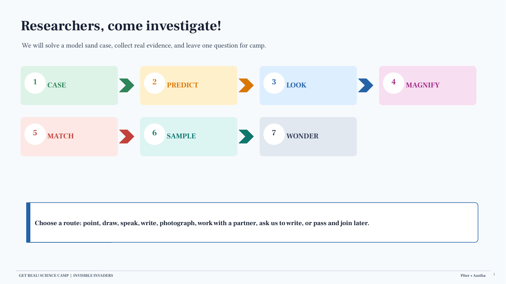
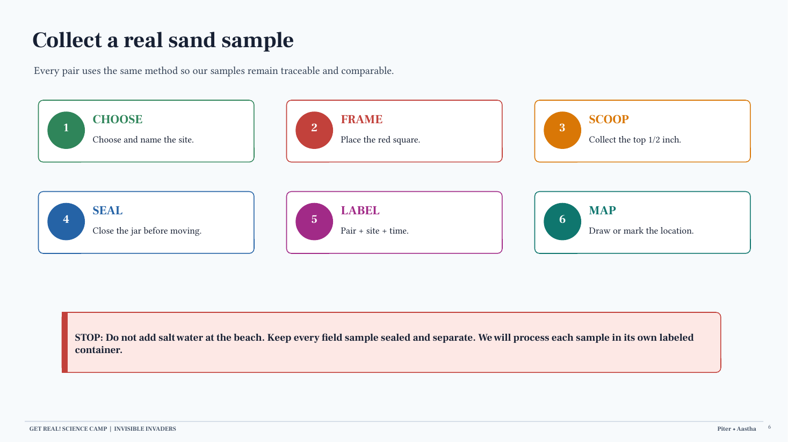

# Invisible Invaders: Field Friday Guide

- **Date:** July 24, 2026
- **Place:** Charlotte Beach
- **Team:** Piter Garcia and Aastha
- **Audience:** up to 12 campers total, working in pairs; plan for about 3 campers per 40-minute rotation
- **Schedule backup:** a 12-minute version appears near the end

**Use these two files together:**

- [04 - Friday Anchoring Phenomenon Routine](https://docs.google.com/document/d/16iqraS0TefwyGQdTOlp2s-sQnIWB6DgCOptWtB8vWJ0/edit)
- [Field Friday Visual Guide](https://docs.google.com/presentation/d/1aEEMEWiIwTtmNnP2zNhW21cBl0Aow-OQW-kSC7mMfrk/edit)

## Start Here

### Anchoring Phenomenon

> **Humans aren't trash cans, but we have plastics in our bodies.**

### Driving Question

> **How does plastic break into tiny pieces, move through the environment and into living bodies, and how can we stop it fairly?**

### Friday Connecting Question

> 🟩 **GOTTA-HAVE 1: EARTH SYSTEMS ARE INTERCONNECTED.** How can plastic move among or collect in sand, water, air, living things, and human systems even when we do not notice it at first?

### Friday Learning Goal

**Campers use a fictional model case to practice observation, magnification, evidence matching, revision, and uncertainty before they collect real Charlotte Beach sand.** By the end, each camper can:

1. separate what they **noticed** from what they **think**;
2. use at least two features to support a model-sample match;
3. name one limit of the model;
4. collect and label a traceable field sample; and
5. leave one question for Monday's investigation.

## Color And Word Key

- 🟩 **GOTTA-HAVE 1:** Earth systems are interconnected.
- 🔵 **SCIENCE:** how or why something happens.
- 🟢 **EVIDENCE:** what we observed, counted, sourced, or still do not know.
- 🟠 **JUSTICE/ACTION:** who is affected, who decides, and what could change fairly.
- 🟣 **ACCESS:** an equivalent route for doing the same rigorous science.

## The Lesson In One View

```text
CASE → PREDICT → LOOK → MAGNIFY → MATCH → REFLECT → SAMPLE → WONDER
```

| Time | Campers do | Piter leads | Aastha protects |
| ---: | --- | --- | --- |
| 0-3 min | See the whole routine and choose a participation route | Welcome, agenda, and one direction | Materials, emotional check, and quiet/seated options |
| 3-7 min | Enter the fictional bird-and-sand case | Tell the case and name that it is a model | Show the model bird, clue, and response choices |
| 7-10 min | Watch one complete investigation cycle | Demonstrate predict -> look -> magnify -> record | Time, reset, and contamination control |
| 10-18 min | Investigate the Durand reference model | Prompt one step at a time | Record exact observations and feelings |
| 18-26 min | Investigate the Ontario reference model | Repeat the same method | Support tool use and partner roles |
| 26-30 min | Compare the mystery clue, make a claim, and revise | Reveal the known model answer and evidence limit | Collect the case reflection |
| 30-34 min | Propose and map real sampling sites | Facilitate site choice | Match labels, journals, and map |
| 34-38 min | Collect, seal, label, and map real sand | Protect a consistent method | Check every jar and field card |
| 38-40 min | Leave one observation or question | Close with anchor and driving question | Save exact youth questions for Monday |

## Prepare The Fictional Case

### Case Language

**SAY:** "In our fictional case, researchers found model birds that needed care near Lake Ontario. Each bird came with a sealed sand clue. Your job is to compare that clue with two reference models and decide which one it best matches."

**Immediately add:** "This is a model story. It is not a report of a real injured bird, and matching the sand cannot tell us why an animal needed care."

### Build A Known-Answer Model

Prepare three sealed model containers:

1. **DURAND REFERENCE MODEL:** clean sand plus one recoverable proxy pattern.
2. **ONTARIO REFERENCE MODEL:** clean sand plus a clearly different recoverable proxy pattern.
3. **MYSTERY BIRD CLUE:** an exact duplicate of one reference pattern.

Use differences that campers can compare through more than one feature, such as grain color, proxy color, proxy shape, first-look count, and magnified count. Keep a facilitator answer card with the exact match and counts.

**Do not present the reference models as real beach-composition data.** If authentic, traceable sand from Durand Eastman Park or Ontario Beach Park is later used, label it separately and do not add proxy pieces while calling it unaltered field evidence.

> 🟢 **EVIDENCE LIMIT:** The model can support a best match because adults built a known answer. It cannot prove where a real bird traveled, why an animal became sick, whether an outdoor fragment is plastic, or how much plastic is at either park.

## Pack This Exact Kit

### Friday Station

| Item | Quantity | Use |
| --- | ---: | --- |
| Durand and Ontario reference-model jars | 2 | Known comparison evidence |
| Mystery bird-clue jar or sealed bag | 1 | Known-answer match |
| Model bird in a box | 1 | Fictional case prop; must be clearly labeled MODEL |
| Field-sample jars | 6 | One sealed jar per camper pair |
| Clean backup jars | 2 | Breakage, label, or contamination backup |
| Small trays | 3 preferred | One stable work surface per camper in a rotation; two trays plus one clipboard can work |
| Magnifiers | 3 | One per camper in a rotation; reserve by Thursday |
| Clean metal spoons | 6 | One per pair/sample |
| Tweezers | 3 | Prepared model pieces only, not unknown field waste |
| Red sampling squares | 6 | Consistent collection area |
| Sharpies and labeling tape | 1 set | Jar and lid labels |
| Clipboards and journals | 12 | Evidence records and site maps |
| Sticky notes or question cards | 12+ | Monday question board |
| Emoji stickers or emotion cards | 12+ | Nonverbal feeling check |
| Timer, camera/tablet, and paper backup | 1 each | Pacing and evidence documentation |
| Hand-cleaning supplies and separate bins | 1 set | Clean tools, used tools, models, and field samples |
| Optional lab coats | Up to 3 | Role-play only; not required PPE and kept away from open samples |

### Monday Processing Materials

These items are captured from the newer packet but **do not enter the Friday field sample**:

- six clean receiving/processing jars;
- prepared sodium-chloride brine in a labeled reservoir;
- filters, funnels, drying dishes, and covers;
- the [Sand Density-Separation And Filtration Guide](sand-density-separation-and-filtration-guide.md).

**Do not pour six field samples into one shared salt-water jar.** On Monday, each labeled sample is processed separately so the location evidence remains traceable.

## Print And Display Plan

The current print-shop handoff has one rule:

> **Print every PDF in `01-SEND-TO-UPS-PRINT-ONLY` exactly once. Copy counts are already built into each PDF.**

Raw lesson-plan templates, source notes, and review files stay outside that folder. The physical PDFs contain no URLs or clickable links.

| Printed artifact | Built-in output | Paper and finishing |
| --- | ---: | --- |
| Print-shop instruction sheet | 1 page | Letter, color, regular paper |
| Field Friday visual sequence | 8 pages | Letter, landscape, color, regular paper |
| Durand model evidence record | 12 copies | Letter, color, regular paper |
| Ontario model evidence record | 12 copies | Letter, color, regular paper |
| Fictional case mission | 6 sheets / 12 cards | Letter, color cardstock, cut in half |
| Case reflection | 6 sheets / 12 cards | Letter, color cardstock, cut in half |
| Real sand-sampling record | 4 sheets / 8 cards | Letter, black and white cardstock, cut in half |
| Traceable sand-sampling steps | 6 copies | Letter, color cardstock, do not cut |
| Sample and model labels | 2 sets | Letter, color cardstock, cut on dashed lines |
| Access and evidence board | 2 copies | Letter, color cardstock, do not cut |
| Family note | 15 copies | Letter, color, regular paper |
| Facilitator cue sheet | 4 pages / 2 sets | Letter, color, regular paper |

The eight sampling records support **six pair samples plus two spares**. The six full-page sampling protocols give each pair a readable visual guide. The two-page facilitator cue sheet replaces the raw lesson-plan export at the station.

For on-screen review, use the [public-safe print artifact master](../../public-submissions/invisible-invaders-field-friday-print-artifacts.pdf) and the [two-page facilitator cue sheet](../../public-submissions/invisible-invaders-field-friday-facilitator-cue-sheet.pdf). The family note is excluded from the public master because its photographs are managed in the private course-materials layer.

## Before Campers Arrive

- [ ] Confirm the final camper count, rotation timing, weather plan, and photo permissions.
- [ ] Prepare and pilot both reference models and the mystery clue; photograph the correct setup.
- [ ] Confirm every proxy piece is clean, recoverable, counted, and contained.
- [ ] Print the packet using the quantities above.
- [ ] Put the station sign, visual agenda, model bird, and three model containers in order.
- [ ] Label each field jar and lid before leaving the station.
- [ ] Place clean spoons, red squares, journals, and sampling cards in six pair kits.
- [ ] Keep model materials, real samples, clean tools, and used tools in separate bins.
- [ ] Select final Charlotte Beach sampling sites with instructors and mark safe boundaries.
- [ ] Agree on the case answer, exact reveal language, and the signal for switching Piter/Aastha roles.
- [ ] Keep brine, receiving jars, filters, and drying materials packed for Monday, not open at the beach.

## The 40-Minute Routine

### 1. Welcome And Access Preview (0:00-3:00)

Show the entire visual sequence before asking campers to begin.

**SAY:** "We will solve a model case, compare evidence, collect a real sample, and leave one question. You may point, draw, speak, write, photograph, work with a partner, ask us to write, choose a seated role, or pass and join later."

Campers choose or change roles: observer, card chooser, recorder, photographer, timer, materials monitor, sampler, labeler, mapper, or seated coordinator.

### 2. Launch The Fictional Case (3:00-7:00)

Show the model bird, sealed clue, and two reference jars.

**SAY:** "Which reference model best matches the bird's sand clue: Durand or Ontario? We will make a first prediction, gather more evidence, and revise if the evidence changes our thinking."

Use the emotion card or stickers:

- How do you feel about solving a case with evidence?
- How would hidden material in beach sand make you feel?

No camper must discuss their own body, health, or family experience.

### 3. Demonstrate One Full Cycle (7:00-10:00)

Model the process in under three minutes:

1. read the model label;
2. record a first prediction and confidence;
3. look without magnification;
4. count visible proxy pieces;
5. magnify and record what changes;
6. use the sentence starters **I noticed / I think / We still need**; and
7. reset every model piece over a tray.

**SAY:** "The model has a known answer because we built it. A real beach sample does not. The goal is not a perfect first guess. The goal is to notice, compare, and revise."

### 4. Investigate Durand (10:00-18:00)

Each camper completes the Durand record.

**BEFORE:** "How many prepared proxy pieces do you think are inside? What makes you think that? How confident are you?"

**DURING:** "How many can you see first? What becomes easier to notice with the magnifier?"

**FEELING CHECK:** campers may select an emoji, point, write, speak, or pass.

Do not reveal the model count yet.

### 5. Investigate Ontario (18:00-26:00)

Repeat the exact method with the Ontario reference model. Keeping the method the same is part of the science.

Campers compare:

- grain color and size;
- proxy color and shape;
- first-look proxy count;
- magnified proxy count; and
- any other repeatable pattern.

### 6. Match, Reveal, And Reflect (26:00-30:00)

Give campers the mystery clue. Ask:

1. "Which reference is the best match?"
2. "What two pieces of evidence support your claim?"
3. "What can this model not tell us?"

Reveal the facilitator answer card only after campers record a claim.

Campers complete:

- **At first, I thought ...**
- **After investigating, I learned ...**
- **One thing I now wonder is ...**
- **One limit of this model is ...**

Recognition is for careful noticing, revising, explaining, helping, and cleanup, not speed or a correct first guess.

### 7. Choose Real Sampling Sites (30:00-34:00)

**SAY:** "The model had a known answer. Charlotte Beach does not. Where should we collect sand so our samples can answer a useful comparison question?"

Campers propose sites, then draw or mark the agreed location in their journal. Choose safe sites with instructors. Possible comparison features include distance from the water, wrack line, foot traffic, vegetation, or nearby drainage, but do not predetermine the result.

### 8. Collect, Seal, Label, And Map (34:00-38:00)

Every pair follows the same field protocol:

1. go to the assigned, recorded site;
2. place one red square flat on the sand;
3. use one clean metal spoon to collect the top **1/2 inch** inside the square;
4. place the sand directly into the pair's field jar;
5. seal the jar before moving;
6. label both jar and lid: `II-Rotation-Pair-Site-Time`;
7. record weather, tool, visible conditions, and possible contamination; and
8. return the sealed jar and field card to Aastha.

> **STOP:** Do not add salt water at the beach. Do not combine pair samples. Do not call a visible field fragment confirmed microplastic.

### 9. Leave One Question And Close (38:00-40:00)

Offer one prompt at a time:

- What might a first look miss?
- How could plastic move through connected systems?
- What evidence would confirm a suspected particle?
- Where could a fair system change interrupt the pathway?

**CLOSING LINE:** "The model had a known answer. The beach does not. Our labels, samples, and questions will help us investigate without pretending we already know."

Save campers' exact words for Monday's question board.

## Co-Teaching Cues

### Piter

- Show the visual agenda and launch one direction at a time.
- Tell the case as fictional and name the evidence boundary immediately.
- Demonstrate the complete cycle before campers begin.
- Lead the claim-evidence-limit discussion and the final anchor.

### Aastha

- Manage the model bird, jars, trays, worksheets, emotion choices, and timer.
- Record campers' exact language and proactively offer help.
- Verify field jar, lid, map, and card labels before a sample leaves the station.
- Give transition warnings and collect the case reflections.

### Both

- Keep explanations short and hands-on time long.
- Offer movement, seated, quiet, touch-free, partner, home-language, scribe, and pass routes.
- Never rank reading, speaking, speed, stamina, or accuracy as scientific ability.
- Ask before helping and preserve wait time.
- Reduce repetition rather than access when time or energy drops.

## What We Can And Cannot Claim

### What We Can Claim

- 🟢 **EVIDENCE:** First-look and magnified counts may differ in the controlled model.
- 🔵 **SCIENCE:** Sand can hide material from a first visual inspection.
- 🟢 **EVIDENCE:** Multiple matching features support a model comparison better than one feature.
- 🟢 **EVIDENCE:** Consistent sampling and traceable labels make field comparisons more defensible.
- 🔵 **SCIENCE:** Plastic can become smaller and move through connected Earth, living, and human systems.
- 🟠 **JUSTICE/ACTION:** Product, infrastructure, monitoring, prevention, and cleanup decisions shape plastic pathways and who can change them.

### What We Cannot Claim

- **The fictional bird case does not report a real event or explain why any animal was sick.**
- **The Durand and Ontario reference models do not measure plastic at either park.**
- **A visible field particle is not chemically confirmed plastic.**
- **One observation does not establish a particle's exact source, route, dose, or health effect.**
- **Detection in selected human samples does not prove the same exposure or effect for everyone.**
- **Young people and families are not individually responsible for systems they do not control.**

## Facilitator Responses

- **"Are these real beach samples?"** "These are reference models we built. The real samples are the sealed ones we collect and label at Charlotte Beach."
- **"Did these birds really get sick?"** "No. This is a fictional model case for practicing how evidence matching works."
- **"That piece is microplastic."** "It may be a suspected fragment. What evidence would confirm the material?"
- **"Is plastic hurting my body?"** "Scientists have detected plastic particles in some samples and are still studying routes and effects. We will not claim more than the evidence shows."
- **If uncertainty creates anxiety:** name what is known, what remains open, and what happens next.
- **If time or energy drops:** protect the model/real-evidence distinction, one comparison, the field label, and one youth question.

## Monday Handoff

Field Friday ends with sealed, traceable samples. Monday uses the separate laboratory sequence:

```text
SAMPLE → ADD BRINE → SETTLE → TRANSFER TOP LAYER → FILTER → COVER/DRY → INSPECT
```

Use the [Sand Density-Separation And Filtration Guide](sand-density-separation-and-filtration-guide.md). Keep every sample, receiving jar, filter, drying dish, image, and observation under the same sample ID.

## Twelve-Minute Schedule Backup

Use only if instructors confirm a short rotation.

1. **1 minute:** Show CASE -> PREDICT -> LOOK -> MAGNIFY -> MATCH -> SAMPLE -> WONDER and participation routes.
2. **2 minutes:** Tell the fictional case and model one complete cycle.
3. **4 minutes:** Campers compare one reference model with the mystery clue.
4. **3 minutes:** Collect, seal, label, and map one shared field sample.
5. **2 minutes:** Save one observation or question and close.

**Protect the fictional-case disclosure, evidence limit, sample traceability, and one youth question.**

## After Every Rotation

- [ ] Recover and count every prepared proxy piece.
- [ ] Reset the reference models and mystery clue to the photographed arrangement.
- [ ] Confirm each field jar and lid match the field card and map.
- [ ] Store models and field samples in separate labeled bins.
- [ ] Photograph only permitted, non-identifying evidence.
- [ ] Move exact youth questions to Monday's board.
- [ ] Record one access change and one materials task, with an owner.

## Visuals

- [Field Friday Visual Guide - Google Slides](https://docs.google.com/presentation/d/1aEEMEWiIwTtmNnP2zNhW21cBl0Aow-OQW-kSC7mMfrk/edit)
- [Field Friday Visual Guide - PPTX](../../public-submissions/invisible-invaders-field-friday-visual-guide.pptx)
- [Field Friday Visual Guide - PDF](../../public-submissions/invisible-invaders-field-friday-visual-guide.pdf)






[Open the full-size sample-model visual](https://drive.google.com/file/d/1iA1BeV_iE4AFTSAqduKPpbjLVHLc48K5/view)

## Trusted Sources And Working Documents

- [EPA Microplastic Beach Protocol](https://www.epa.gov/system/files/documents/2021-09/microplastic-beach-protocol_sept-2021.pdf)
- [NOAA Marine Debris Program: Microplastics](https://marinedebris.noaa.gov/what-marine-debris/microplastics)
- [EPA: Microplastics Research](https://www.epa.gov/water-research/microplastics-research)
- [FDA: Microplastics and Nanoplastics in Foods](https://www.fda.gov/food/environmental-contaminants-food/microplastics-and-nanoplastics-foods)
- [CAST UDL Guidelines 3.0](https://udlguidelines.cast.org/)
- [Current Invisible Invaders Camp Operations Guide](https://docs.google.com/document/d/1LueJ9NX6MP257ywABKTDu-vVWVYzTwRnNDK8fgJx4e0/edit)
- [Field Friday Daily Lesson Plan](https://docs.google.com/document/d/1scrYMeSEja_MUvyx9DkV6EzKMpMOmHB4gz60fMOAFgg/edit)
- [Friday Done source packet](https://docs.google.com/document/d/1vpMdBbTJAJRYH0OOQwd1GC8pjrRMzCu8UoeZ5RVQI80/edit)

## AI Use Disclosure

AI was used under Piter Garcia's supervision to organize, structure, format, visualize, and enhance content provided by Piter, Aastha, the course team, and course sources so this guide is more accessible and inclusive. Piter guided and reviewed the lesson decisions, inclusion requirements, evidence limits, and sources. AI supported source validation and checks for missing causal, access, safety, and logistical links. Piter remains responsible for the science, safety, representation of Aastha's contributions, and final use or submission.
