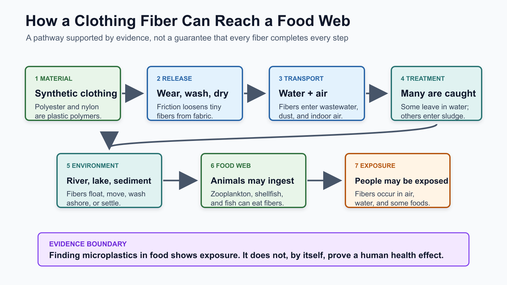
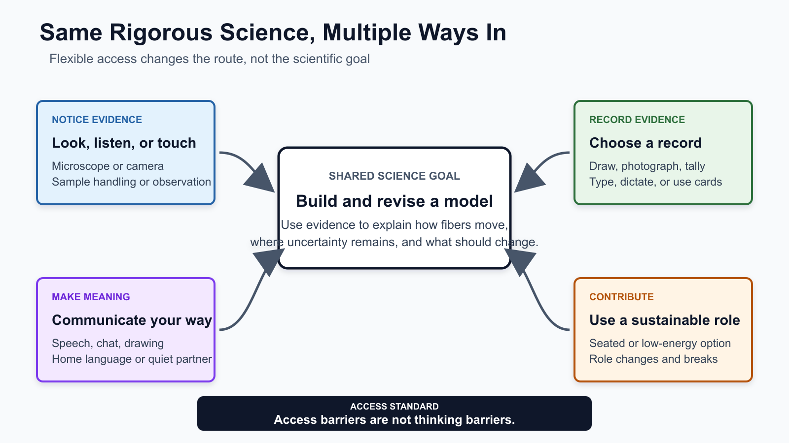

# Fiber Fighters: Tiny Fibers, Big Systems

**Team:** Misong and Piter

**Shared working document:** [Fiber Fighters Gapless Explanation](https://docs.google.com/document/d/1onKUk2pjF5nzpMYp_mhhpSb9lGbT40ke9QCgC_EdyDM/edit)

> **Our question:** How can fibers from clothing end up in water, fish, and food when we cannot even see them?

**Color key:** 🟩 **SCIENCE** = what happens | 🟦 **EVIDENCE** = how we know | 🟪 **ACCESS** = multiple ways into the work | 🟧 **JUSTICE/ACTION** = power and change

The labels repeat throughout the page so color is never the only cue.

## The 60-Second Explanation

1. 🟩 **MATERIAL:** Polyester, nylon, acrylic, and spandex are synthetic polymers made by joining small chemical units into long molecular chains. Manufacturers melt or dissolve these polymers, pull them into threads, and weave or knit the threads into fabric. The shirt may feel soft, but each synthetic thread is still plastic material that can break into smaller plastic fibers. [NOAA explains synthetic microfibers](https://marinedebris.noaa.gov/what-marine-debris/microplastics).
2. 🟩 **RELEASE:** Everyday wearing bends and rubs fabric, while washing and drying add water, detergent, heat, and repeated friction. This mechanical stress loosens pieces from the threads and releases them into wash water, dryer exhaust, and household dust. When a released plastic fiber is smaller than five millimeters, it falls within the common definition of a microplastic. [NOAA: microplastics and microfiber shedding](https://marinedebris.noaa.gov/what-marine-debris/microplastics).
3. 🟩 **TRANSPORT:** After a washing machine drains, released fibers enter the wastewater system. Other fibers move through dryer exhaust, indoor air, household dust, stormwater runoff, or sewage sludge, so there is more than one route from clothing to the environment. Their path depends on local infrastructure, disposal practices, weather, and where captured waste is later placed. [EPA identifies textile microfibers and washing-machine wastewater as land-based sources](https://www.epa.gov/plastics/about-plastic-products-and-plastic-pollution).
4. 🟦 **TREATMENT:** Treatment plants use screening, settling, and biological processes that remove many particles from wastewater. Because fibers differ in size, shape, and density, the system does not capture every one; some remain in treated effluent released to waterways. Many captured fibers concentrate in sewage sludge, which can create another pathway if sludge is land-applied or moved. [Peer-reviewed wastewater-treatment review](https://www.mdpi.com/2076-3417/11/21/10109).
5. 🟩 **FOOD WEB:** Once fibers reach rivers, lakes, or oceans, some float, some remain suspended, some wash ashore, and others settle into sediment. Small organisms may swallow fibers directly or ingest them while feeding, and larger animals may then eat those organisms. This creates possible movement through a food web, although not every fiber follows the same path or stays in an animal. [NOAA: wildlife and microplastics](https://marinedebris.noaa.gov/what-marine-debris/microplastics).
6. 🟦 **EVIDENCE LIMIT:** Scientists have reported microplastics in air, water, seafood, and other foods, so their presence documents routes of human exposure. Detection alone does not tell us the dose, duration, particle chemistry, or biological response, and therefore cannot by itself prove a specific health effect. FDA and WHO continue to assess the evidence and identify research gaps. [FDA evidence summary](https://www.fda.gov/food/environmental-contaminants-food/microplastics-and-nanoplastics-foods) and [WHO research review](https://www.who.int/publications/i/item/9789240054608).
7. 🟧 **SYSTEM CHANGE:** Microfiber pollution is shaped before a garment reaches a household: material selection, fabric construction, production volume, labor conditions, product durability, and wastewater infrastructure all influence what is released and who bears the consequences. Repair and reuse can help, but families cannot solve an industrial system through purchasing choices alone. Companies, institutions, governments, and communities share responsibility for structural change. [UNEP: textiles and pollution](https://www.unep.org/interactives/beat-pollution/).

## See The Whole Path

*Click the image for the full-size model. It synthesizes evidence from [NOAA](https://marinedebris.noaa.gov/what-marine-debris/microplastics), [EPA](https://www.epa.gov/plastics/about-plastic-products-and-plastic-pollution), the [peer-reviewed wastewater review](https://www.mdpi.com/2076-3417/11/21/10109), [FDA](https://www.fda.gov/food/environmental-contaminants-food/microplastics-and-nanoplastics-foods), and [WHO](https://www.who.int/publications/i/item/9789240054608).*

## Our Gapless Claim

> **Synthetic clothing is plastic. Friction releases tiny fibers. Water, air, and waste systems move them. Wildlife may ingest them, and people may encounter them. Industry design and unequal power shape the problem, so solutions must include structural change as well as personal creativity.**

### What we will **not** claim

- **Possible is not automatic:** not every fiber completes every step.
- **Detected is not proven harmful:** exposure evidence is not the same as health-risk evidence.
- **People are not the whole problem:** asking families to “shop better” cannot replace industry, infrastructure, and policy change.

## 🟪 Inclusion Changes The Design

Neurodivergent, chronically ill, disabled, multilingual, culturally diverse, and multiply identified campers should not have to overcome the activity before they can do the science. [CAST UDL Guidelines 3.0](https://udlguidelines.cast.org/more/about-guidelines-3-0/) specifically emphasizes multiple and intersecting identities, multiple media, multiple forms of communication, accessible tools, learner choice, belonging, and challenging exclusionary practices.

*Click the image for the full-size access model. Design basis: [CAST UDL Guidelines 3.0](https://udlguidelines.cast.org/more/about-guidelines-3-0/).*

| A barrier might hide thinking when... | We design... | The science stays rigorous because campers still... |
| --- | --- | --- |
| speech, English dominance, or processing time controls participation | speech, chat, drawing, audio, home-language discussion, and quiet-partner options | explain causes, use evidence, and revise a model |
| pain, fatigue, mobility, or standing controls who can do the procedure | seated and low-energy roles, breaks, role changes, and materials within reach | handle samples, control contamination, tally, or interpret evidence |
| sensory load or attention shifts make the sequence hard to hold | a visible agenda, one-step cards, predictable transitions, quiet options, and repeated vocabulary | follow the investigation and explain what changed in their thinking |
| one technology becomes the gatekeeper | microscope camera **and** direct viewing; digital tally **and** paper backup | observe, document uncertainty, compare results, and make a defensible claim |

## Five Camp Moves

1. 🟦 **NOTICE:** Examine clothing labels and ask what the material becomes when tiny pieces break away.
2. 🟪 **MODEL:** Build a first explanation with drawing, cards, objects, speech, text, or home language.
3. 🟦 **INVESTIGATE:** Filter a sample, examine it, classify suspected fibers/fragments, tally evidence, and mark uncertainty.
4. 🟩 **REVISE:** Compare the evidence with trusted sources and repair missing links in the model.
5. 🟧 **ADVOCATE:** Use visible mending or reclaimed-textile art to tell a real audience what companies, institutions, communities, and individuals should change.

This follows the idea of a [gapless explanation in Ambitious Science Teaching](https://ambitiousscienceteaching.org/get-started/): observable events are connected to mechanisms without “magic” jumps.

## Why Clothing Requires A Multiple-Identities Lens

Clothing can carry culture, religion, gender expression, disability access, sensory regulation, safety, money, family expectations, creativity, and belonging. We can investigate microfiber pollution without shaming people for wearing what is affordable, culturally meaningful, or physically tolerable. Misong's connection between visible mending and Black punk history also lets campers see clothing as culture, resistance, activism, and joy, not only as waste.

## Trusted Evidence Library

### Science and health

- [NOAA Marine Debris Program: Microplastics](https://marinedebris.noaa.gov/what-marine-debris/microplastics)
- [U.S. EPA: Plastic Products and Plastic Pollution](https://www.epa.gov/plastics/about-plastic-products-and-plastic-pollution)
- [Peer-reviewed review: Microplastics in Wastewater and Drinking Water Treatment Plants](https://www.mdpi.com/2076-3417/11/21/10109)
- [FDA: Microplastics and Nanoplastics in Foods](https://www.fda.gov/food/environmental-contaminants-food/microplastics-and-nanoplastics-foods)
- [WHO: Dietary and Inhalation Exposure to Microplastics](https://www.who.int/publications/i/item/9789240054608)

### Justice and systems

- [UN Environment Programme: Textiles and Pollution](https://www.unep.org/interactives/beat-pollution/)
- [American Society of Civil Engineers: Fast Fashion and Microplastic Water Pollution](https://www.asce.org/publications-and-news/civil-engineering-source/article/2026/02/03/the-fast-fashion-trend-is-adding-to-microplastic-water-pollution)
- [Encyclopaedia Britannica: Fast Fashion](https://www.britannica.com/art/fast-fashion)

### Access and learning design

- [CAST UDL Guidelines 3.0](https://udlguidelines.cast.org/more/about-guidelines-3-0/)
- [CAST: About Universal Design for Learning](https://www.cast.org/resources/about-universal-design-for-learning/)
- [Ambitious Science Teaching: Getting Started](https://ambitiousscienceteaching.org/get-started/)

## AI Use Disclosure

OpenAI Codex was used on July 14, 2026 under my supervision and guidance to help make this material more inclusive and accessible. I, Piter Garcia, provided, reviewed, and guided all final content; AI assisted with structuring, formatting, visual presentation, and accessibility enhancements for neurodivergent, chronically ill, disabled, multilingual, culturally diverse, and multiply identified learners. AI also helped check causal gaps, validate claims, and connect the explanation to direct sources. I reviewed the final language, evidence, representation of Misong's contributions, and design, and I remain responsible for what we submit.
