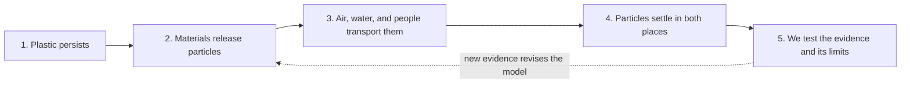

# Invisible Invaders: How We Used The Gotta-Have Checklist

**Team:** Piter Garcia and Aastha

**Anchoring phenomenon:** Suspected microplastics can appear in samples from an outdoor parking lot and inside a closed classroom, even when we cannot see them with our unaided eyes.

**Driving question:** How can invisible plastic particles reach both places, how certain can we be about what we find, and what should our community do with that evidence?

> **Bottom line:** We used the checklist to decide which science ideas every activity must help campers discover, test, and add to their model. The gapless explanation supplied the causal science, the checklist reduced it to five indispensable ideas, and the SASSY table turns each activity into evidence for one or more of those ideas. Our earlier plan followed this structure, but the checklist was not visible enough; this version makes it an explicit student tool.

## The Five Gotta-Have Ideas

The checklist contains **causal ideas**, not activity names, broad topics, or every interesting fact about plastics.

- [ ] **1. Plastic persists as it becomes smaller.** Plastic can weather and fracture into pieces smaller than 5 millimeters without disappearing. This explains why plastic may remain present after it becomes difficult or impossible to see with unaided eyes.
- [ ] **2. Friction and weathering release particles from indoor and outdoor materials.** Tire and road wear, litter, paint, textiles, furnishings, and classroom materials can all release particles. These sources help explain why both the parking lot and classroom can contain suspected microplastics.
- [ ] **3. Air, water, and human activity transport small particles.** Moving air, walking, cleaning, ventilation, rain, runoff, shoes, clothing, and equipment can carry particles away from their original sources. A particle does not have to stay where it was released.
- [ ] **4. Particles settle and accumulate, and a closed room is not a sealed room.** Gravity and contact deposit suspended particles onto floors, desks, dust, and collection surfaces. Doors, ventilation, people, clothing, and past activity continue to connect an apparently closed classroom with other spaces.
- [ ] **5. Our methods reveal suspected particles, not automatic proof of plastic.** Filters and microscopes let us describe and compare fibers or fragments, while blanks and clean procedures help us notice contamination. Visual appearance alone does not confirm polymer type, so our claims must match the limits of our evidence.

## How The Lesson Uses It

| Lesson moment | What campers do | Checklist evidence added to the model | Why it belongs |
| --- | --- | --- | --- |
| **Day 1: Notice, wonder, first model** | Encounter the indoor/outdoor discrepancy, compare banana and plastic, use the scale ladder, make a before/during/after model, and build a question wall | **1** plus initial ideas for **2-4** | Campers begin with their own explanations before we give them answers. The first model shows what they already think and what the class needs to investigate. |
| **Day 2: Sources, pathways, paired sampling** | Map possible sources; collect matched parking-lot, classroom, and blank samples; label and cover them consistently | **2-4** and the beginning of **5** | Source mapping makes release and movement visible. Matched samples and a blank make the collection process part of the evidence rather than treating every observed particle as environmental proof. |
| **Day 3: Observe, compare, revise** | Filter or view samples; classify suspected fibers and fragments; compare indoor, outdoor, and blank results; revise the model | **5**, then revisions to **2-4** | The observations may support, complicate, or weaken an earlier pathway. Campers revise rather than decorate a finished answer. |
| **Day 4: Explain, interrogate justice, advocate** | Check the final model for all five ideas; write or record the gapless explanation; compare model history; map power, burden, benefit, and possible action | **1-5**, followed by a separate justice-and-action check | The model must explain the phenomenon and respect evidence limits. Youth then use the explanation to evaluate systems and communicate a defensible action to a real audience. |

## The Checklist-SASSY-Model Connection

For every activity, we ask the same five questions:

1. **Activity:** What will we do or examine?
2. **Observation:** What did we notice?
3. **Why:** What mechanism could explain it?
4. **Clue:** Which numbered checklist idea does this evidence help us understand?
5. **Model move:** What should we add, remove, question, or change in our model?

The checklist is therefore not a quiz at the end. It is a navigation tool kept beside the model throughout the week. A camper can point to, draw, speak, type, dictate, or use home language to explain a checklist connection; every route still requires evidence and causal reasoning.

## Activity Is Not The Same As A Gotta-Have Idea

| Useful activity or extension | What it supports | Why it is not another checklist item |
| --- | --- | --- |
| Banana-and-plastic comparison | Idea **1**, persistence and visible change | It is one experience used to investigate persistence, not a required part of every causal explanation. |
| Tire image, sealed sample, or source map | Idea **2**, release from materials | Tire wear is an important example, but the broader transferable idea is that friction and weathering release particles. |
| Recoverable paper pieces and controlled air movement | Ideas **3-4**, transport and settling | The paper model represents a mechanism; it is not direct evidence of actual microplastic behavior. |
| Microscope or camera station | Idea **5**, observation and uncertainty | A microscope is a tool. The scientific idea is that observations and controls support limited claims. |
| Greenhouse-gas and temperature extension | Plastic life-cycle systems connection | It is a valuable secondary phenomenon, but it is not necessary to explain why suspected particles appear in our two samples. |
| Food webs, density, identity activities, videos, and advocacy art | Transfer, engagement, justice, or communication | These may deepen the camp, but adding all of them to the checklist would hide the five causal ideas campers must model. |

## Module 1: Where The Approach Began

| Module 1 foundation | How it appears in Invisible Invaders |
| --- | --- |
| **Teacher as learning scientist** | We compare initial and revised models, notice which supports expand participation, and study how our design choices affect reasoning, motivation, and belonging. |
| **Ambitious Science Teaching: eliciting student ideas** | Notice/wonder, the first model, wait time, and the question wall come before authoritative explanations. Incorrect or incomplete first models are useful evidence of thinking. |
| **PICRAT and purposeful technology** | A microscope camera, shared image, audio response, or digital record is used when it expands observation or contribution. Technology is not a checklist item and is not allowed to become the gatekeeper to the science. |
| **Classroom design and accessibility** | A visible agenda, scaffolded model, defined roles, quiet and low-energy routes, repeated labels, and predictable transitions make the causal sequence easier to hold and revisit. |
| **JuST, culture, and community knowledge** | Youth questions, Rochester places, lived experience, language, identity, and community knowledge shape the investigation and the action it supports. |

## Module 2: How We Turned It Into A Storyline

| Module 2 planning tool | How we used it |
| --- | --- |
| **Anchoring phenomenon** | The surprising indoor/outdoor finding creates questions without giving away the answer. It is bigger than the opening activity and remains visible all week. |
| **Gotta-have checklist** | We condensed the gapless explanation into five necessary, transferable causal ideas. Each activity must produce a clue that helps campers understand or revise one of them. |
| **Gapless explanation** | It is the complete teacher-facing explanation connecting source, release, transport, deposition, detection, and uncertainty without a causal jump. |
| **Scientific modeling** | Campers diagram and describe invisible mechanisms using a scaffolded before/during/after model, make revisions as evidence arrives, and preserve the history of their thinking. |
| **SASSY table and storyline coherence** | Activities are ordered by student questions and linked through observation, mechanism, checklist clue, and the next question. This keeps the camp from becoming disconnected stations. |
| **Backward design** | The five ideas define the desired understanding; the final model and gapless explanation are the evidence; the daily experiences are selected to build that evidence. |
| **Critical consciousness** | After the science is defensible, campers ask who benefits, who bears exposure or cleanup labor, whose evidence counts, who decides, and what collective or structural change is possible. Justice also enters the launch through local patterns and lived experience. |

## What The July 14 Class Evidence Shows

| Approximate timestamp | Planning decision we used |
| --- | --- |
| **00:02:36-00:04:33, camp-planning transcript** | Our six possible ideas were narrowed because the checklist should contain only three to five indispensable causal ideas, not every interesting detail. |
| **00:05:05-00:07:38, camp-planning transcript** | The checklist must match the gapless explanation, guide the lessons, and appear directly beside the model so campers can check ideas as they add them. Individual, partner, and consensus models are all valid routes. |
| **00:09:40-00:10:46, camp-planning transcript** | Our lesson arc became notice/wonder/first model; collect paired samples and a blank; observe/classify/compare/revise; then explain, examine justice, and apply. |
| **00:16:22-00:20:22, camp-planning transcript** | Models are dynamic, causal, public, and revisable. The SASSY sequence links an activity to an observation, an explanation, a checklist clue, and the next question. |
| **00:22:23-00:26:09, camp-planning transcript** | Piter asked to make justice visible from the beginning. The response was to begin with patterns youth can question, then trace the plastic life cycle, benefits, harms, power, and community action. |
| **00:11:56-00:17:16, environmental-inquiry transcript** | Labels, zoom-in bubbles, diagram-and-describe, incomplete first models, wait time, and question Post-its were demonstrated as ways to make invisible mechanisms and unfinished thinking discussable. |
| **00:35:24-00:37:53, environmental-inquiry transcript** | The driving-question board begins with questions rather than teacher answers and organizes youth questions into the planned investigation without pretending the unit has no structure. |
| **01:11:59-01:15:53, environmental-inquiry transcript** | The anchoring-phenomenon routine should connect to lived experience, represent collective voices, and generate investigation and action; the launch activity is not the phenomenon itself. |

The automatic transcripts contain speaker and recognition errors. These entries preserve the planning meaning and timestamps without treating the transcript as a perfect quotation record.

## Justice And Participation Checks

Justice and access drive the whole lesson, but they are kept visible **beside** the causal checklist rather than disguised as additional science mechanisms.

- [ ] **Experience:** Whose local knowledge, language, identity, and questions are represented?
- [ ] **Participation:** Can campers observe, record, model, explain, and regulate through more than one rigorous route?
- [ ] **Burden and power:** Who benefits from plastic systems, who encounters pollution or cleanup labor, and who controls decisions?
- [ ] **Evidence:** Are we separating suspected particles from confirmed plastic and exposure from proven health effects?
- [ ] **Agency:** Does the action fit the evidence, reach a real audience, and move beyond blaming individual youth or families?

No camper should have to exchange respiratory safety, pain, fatigue, mobility, sensory regulation, processing time, language, or privacy for the right to participate as a scientist.

## Ready-To-Use Facilitator Routine

1. Post the five-item checklist next to the large class model and provide personal copies in text-first and image-first formats.
2. After each activity, ask: **What did we observe? Why might it happen? Which checklist clue does it support or complicate?**
3. Add a numbered symbol to the model: **+ add**, **~ change**, **? question**, or **- remove**. Do not rely on color alone.
4. Let campers revise individually, with a partner, or through the consensus model, and preserve earlier versions so growth remains visible.
5. Before the showcase, check that the final model represents all five ideas and that every major claim is connected to evidence or clearly marked uncertainty.

## Connected Work

- [Shared Invisible Invaders Google Doc](https://docs.google.com/document/d/1IFu_y_sYbNeNs1K4J_lD6KS4I30f8wxggX4SS38acRI/edit)
- [Gapless science explanation](invisible-invaders-gapless-explanation.md)
- [Four-day activity plan](invisible-invaders-activities.md)
- [Camp-ready SASSY and modeling tools](task7-camp-tools.md)
- [Source map for protected Module 1 and Module 2 materials](../../docs/source-map.md#module-1-module-2-and-july-14-checklist-evidence)

The source map names the protected local PDFs, slides, and transcripts. They are intentionally not linked as public files because the course materials and class conversations are not part of the public repository.

## AI Use Disclosure

I used OpenAI Codex on July 15, 2026 under my supervision and guidance to organize the course documents and transcripts, make the checklist visible, connect the lesson decisions to Module 1 and Module 2, and improve the accessibility of this evidence map. I, Piter Garcia, provided, reviewed, and guided the content and remain responsible for the final lesson decisions, scientific claims, representation of Aastha's contributions, and materials I approve or submit.
