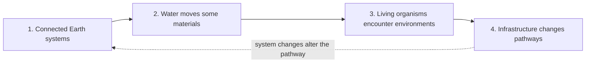

# Invisible Invaders: How We Use The Four Gotta-Have Ideas

**Team:** Piter Garcia and Aastha

**Current anchoring phenomenon:** **Humans aren’t trash cans, but we have plastics in our bodies.**

**Driving question:** How can plastics from everyday materials become small enough to move through connected systems and reach human bodies, and what changes could reduce those pathways fairly?

The human-body phenomenon replaces the earlier tire-based and parking-lot/classroom candidates. The four ideas below are the ideas Piter and Aastha selected together from the course checklist during the July 15 meeting.

## The Four Selected Ideas

- [ ] 🔵 **1. SCIENCE: Earth systems are interconnected.** Plastic particles can move among air, water, soil, food systems, buildings, organisms, and waste systems. A particle may cross several systems before it is detected.
- [ ] 🔵 **2. SCIENCE: Water transports materials.** Rain, runoff, wastewater, rivers, drinking-water systems, and food production can move plastic particles. Water is one pathway, not the only pathway into human bodies.
- [ ] 🔵 **3. SCIENCE: Living organisms respond to environmental conditions.** People and other organisms interact with surrounding air, food, water, and materials through processes such as inhalation and ingestion. Detection documents presence or possible exposure; it does not automatically establish harm.
- [ ] 🔵 **4. SCIENCE: Human infrastructure influences natural systems.** Product design, manufacturing, buildings, food and water systems, waste systems, monitoring, and policy can increase, redirect, capture, prevent, or reveal particle movement.

## Direct SASSY Connecting-Question Map

April's comment on the earlier SASSY table says, **"Each of these should be one of your Gotta Have Checklist items."** The current table therefore names the checklist source inside every connecting question rather than treating the questions as a separate list.

| Storyline stage | Checklist item attached to the connecting question | Image-based team work retained | New element added |
| --- | --- | --- | --- |
| **Field Friday** | **1. Earth systems are interconnected** | Find plastic pieces in four glass jars; compare places; collect and map sand | Connect the jar/sand evidence to systems meeting at the beach while keeping model jars separate from real-site claims |
| **Monday** | **2. Water transports materials** | Article reading, video, and instructor-approved fish dissection/observation or equivalent evidence route | Trace a possible water and food-web pathway while labeling exact route and harm as unresolved |
| **Tuesday** | **3. Living organisms respond to environmental conditions** | Bike racing, rollerblades, or toy wheels; friction, temperature, decay/weathering, and smaller-not-gone observations | Connect the release mechanism to environments organisms may encounter while stating that the trial does not measure a biological response |
| **Wednesday** | **4. Human infrastructure influences natural systems** | Art as advocacy and a return to places from Day 1 | Identify decision-makers, unequal power, a desired future, and an evidence-matched request |
| **Thursday** | **1-4 revisited through synthesis** | Complete the image's blank **future modeling** row | Build one model containing all four ideas, distinct climate and microplastic branches, uncertainty, power, and action |
| **Friday** | **1-4 revisited through evidence check** | Continue model revision rather than start a disconnected activity | Use audience feedback to keep, question, or make one evidence-supported change |

The [July 16 team planning image in Drive](https://drive.google.com/file/d/1ht_b3mBW-9QbYrw7CsuZq2X5EyFXtiAg/view) remains the visual source. In that photograph, the first and advocacy rows still carry the earlier Gotta-Have 4/Gotta-Have 1 placement. Later in the recorded discussion, the team decided to reverse those two. The current map applies that final decision while preserving the activities, observations, causal ideas, and advocacy move visible in the image.

## How The Lesson Uses The Checklist

| Lesson moment | What campers do | Checklist evidence | Model revision |
| --- | --- | --- | --- |
| **Launch: human-sample evidence** | Examine blood- and lung-study evidence cards; sort what the evidence shows, does not show, and makes us wonder | Initial questions for **1-4** | Place known, possible, and unknown markers on the first model |
| **Build possible pathways** | Connect everyday plastic-containing materials to air, food, water, buildings, and possible inhalation or ingestion | **1-3** | Add more than one route and avoid claiming one universal source |
| **Investigate systems and evidence** | Use environmental observations, scale models, direct sources, and evidence-limit cards | **1-4** | Revise routes that the evidence supports, complicates, or cannot answer |
| **Explain and act** | Check the final model for all four ideas; identify a system point, decision-maker, fair request, and evidence limit | **1-4** plus justice/action | Produce an evidence-matched explanation and advocacy product |

## The Checklist-SASSY-Model Routine

After every experience, campers answer the same five questions:

1. 🟢 **EVIDENCE: What did we do or examine?**
2. 🟢 **EVIDENCE: What did we observe or learn from the source?**
3. 🔵 **SCIENCE: Why might it happen?**
4. 🟢 **EVIDENCE: Which checklist idea does the evidence support, complicate, or leave unanswered?**
5. 🟠 **JUSTICE/ACTION: What should we add, change, question, or remove from our model, and what might people change in the system?**

Campers may point, draw, speak, type, dictate, record audio, work with a partner, or use home language. Every route still requires evidence, causal reasoning, uncertainty, and model revision.

## What Is Not A Separate Gotta-Have Idea

| Activity or extension | What it supports | Why it stays outside the four-item checklist |
| --- | --- | --- |
| Plastic persistence comparison | Supports how larger materials can become smaller without disappearing | It is one experience, not the broader Earth-systems idea |
| Size ladder | Supports scale from visible plastic to micro- and nanoscale particles | Scale helps explain invisibility but does not explain the whole phenomenon |
| Human blood and lung evidence cards | Supports organism interaction and evidence limits | A study is evidence for the idea, not the idea itself |
| Environmental sampling and microscopy | Supports movement, monitoring, and uncertainty | A tool or method is not a causal mechanism |
| Greenhouse-gas extension | Supports plastic life-cycle and infrastructure connections | It is a secondary system connection, not required to explain plastics in bodies |
| Advocacy art or public communication | Supports agency, justice, and communication | The action follows the science and is not another scientific mechanism |

## Module 1 And Module 2 Foundations

| Course foundation | How it appears here |
| --- | --- |
| **Teacher as learning scientist** | Compare initial and revised models and study which supports expand reasoning, belonging, and authority. |
| **Eliciting student ideas** | Notice, wonder, first model, private thinking time, and question-building come before authoritative explanations. |
| **Purposeful technology** | Images, microscope cameras, audio, digital diagrams, or shared records are used when they expand observation or contribution; no device owns the science. |
| **Accessibility and bodymind safety** | A visible agenda, body-content preview, environment-only route, quiet and low-energy roles, repeated labels, and predictable transitions protect access without lowering rigor. |
| **Storyline coherence** | Each activity produces evidence for one or more checklist ideas and creates a reason to revise the model or ask the next question. |
| **Backward design** | The four ideas define the desired understanding; the final model and explanation are the evidence; daily experiences are selected to build that understanding. |
| **Critical consciousness** | Campers ask who benefits, who experiences burdens, whose bodies and environments are studied, who controls research and policy, and what collective change is possible. |

## July 15 Meeting Evidence

| Approximate timestamp | Decision used |
| --- | --- |
| **00:05:51-00:06:12** | The team changed the phenomenon to **“Humans aren’t trash cans, but we have plastics in our bodies.”** |
| **00:18:19-00:18:34** | The new phenomenon was recognized as opening several possible sources and pathways instead of restricting the lesson to one material. |
| **00:29:27-00:30:26** | Aastha confirmed the phenomenon was settled; Piter acknowledged that the tire idea could be left behind. |
| **00:36:51-00:39:15** | Piter committed to move the old phenomenon aside and create a clean template around the new phenomenon and checklist. |
| **00:41:53-00:47:18** | Piter and Aastha selected water transport, living organisms, connected Earth systems, and human infrastructure as the four course ideas. |

## Justice And Participation Checks

- [ ] **Experience:** Whose language, identity, community knowledge, and questions shape the model?
- [ ] **Bodymind safety:** Is body-related content previewed, and is there an equivalent environment-only evidence route?
- [ ] **Participation:** Can campers observe, model, explain, regulate, and advocate through more than one rigorous route?
- [ ] **Evidence:** Are detection, route, prevalence, and health effect kept separate?
- [ ] **Power:** Who controls products, research, food and water systems, monitoring, and policy?
- [ ] **Agency:** Does the request fit the evidence, reach a real decision-maker, and avoid blaming youth or families?

## Connected Work

- [Shared Invisible Invaders Google Doc](https://docs.google.com/document/d/1IFu_y_sYbNeNs1K4J_lD6KS4I30f8wxggX4SS38acRI/edit?tab=t.0)
- [Current Camp Operations Guide](../03-camp-unit-plan/invisible-invaders-camp-operations-guide.md)
- [Current editable SASSY Storyline Table](https://docs.google.com/document/d/1fGOjSkEFxsy5UC5n75UIi9aE_-sKOhyeRx9sY8CAUWU/edit)
- [Completed daily lesson plans](https://drive.google.com/drive/folders/1safaE0FAhNHiHRCgexqPKf0WXME8lcQg)
- [Current gapless explanation](invisible-invaders-gapless-explanation.md)
- [Evidence-to-agency visual](../../public-artifacts/invisible-invaders-evidence-to-agency-map.png)
- [Archived July 15 commitment pack](archive/2026-07-18-pre-consolidation/july15-meeting-commitment-pack.md)

## AI Use Disclosure

I used OpenAI Codex on July 16, 2026 under my supervision and guidance to organize the four ideas selected during our meeting, connect them to the current human-body phenomenon, and make the checklist usable through multiple access routes. I, Piter Garcia, provided, reviewed, and guided the content and correction. I remain responsible for the final lesson decisions, scientific claims, representation of Aastha's contributions, and materials I approve or submit.
