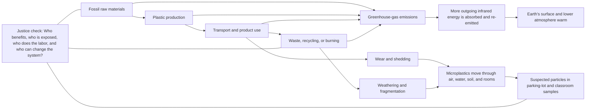

# Invisible Invaders: Plastic, Carbon, And Rising Temperature

**Team:** Piter Garcia and Aastha

**Use in camp:** Short secondary investigation after campers begin the parking-lot/classroom microplastics model

**Recommended time:** 45-55 minutes

**Planning lens:** Puzzle Plan / EQUITAS Access-to-Agency STEM

> **Secondary phenomenon:** The same plastic system can release two kinds of invisible invaders: greenhouse-gas emissions that change Earth's energy balance and tiny plastic particles that move through air, water, soil, and indoor spaces.

This activity does **not** replace our anchoring phenomenon about suspected particles in parking-lot and closed-classroom samples. It helps campers connect that local evidence to the larger plastic life cycle without making the false claim that microplastics themselves caused the temperature change in our model.

## The Connection We Want Campers To Build

### One-Sentence Claim

> **Greenhouse gases and microplastics are different, but they can emerge from the same plastic life cycle: fossil-fuel extraction, energy-intensive production, transportation, use, wear, weathering, and disposal.**

The [United Nations Environment Programme](https://www.unep.org/news-and-stories/story/everything-you-need-know-about-plastic-pollution) reports that plastics generated about 1.8 billion metric tonnes of greenhouse-gas emissions in 2019, while plastic products also fragment or shed into microplastics. [NOAA](https://gml.noaa.gov/education/faq_cat-3.html) explains that carbon dioxide absorbs outgoing infrared radiation, changing Earth's energy balance. These sources support the system connection; they do not show that a suspected particle in one of our samples caused climate change.

## Why We Should Not Depend On A CO2 Bottle Alone

A common activity puts ordinary air in one bottle, makes CO2 with vinegar and baking soda in another, and places both under a lamp. It looks direct, but small differences in humidity, mixing, pressure, bottle position, thermometer placement, and lamp distance can overwhelm the small CO2 effect. NASA's classroom guidance notes that adding actual CO2 does not produce consistent small-scale results and that a covered-container model does not trap heat in the same way greenhouse gases interact with infrared radiation.

Our solution is a **three-part model**:

1. A physical chamber makes energy accumulation and rising temperature visible.
2. The [PhET Greenhouse Effect simulation](https://phet.colorado.edu/sims/html/greenhouse-effect/latest/greenhouse-effect_en.html) shows what CO2 does to infrared energy.
3. A plastic-life-cycle map connects climate emissions to microplastic release, transport, justice, and action.

No single part has to pretend it represents the entire Earth system.

## Materials

### Physical Temperature Model

- two identical clear, heat-safe containers, about 1-2 liters each;
- two matching digital temperature probes, preferably readable to 0.1 degrees Celsius;
- two identical pieces of black cardstock or felt for the model surfaces;
- one transparent rigid cover or reusable clear sheet for one container;
- one stable incandescent or heat lamp centered equally between the containers;
- measuring tape and floor/table marks to keep both containers the same distance from the lamp;
- timer and the data table below;
- heat-resistant mat, lamp guard, and adult-access-only boundary;
- optional large display, document camera, or projected temperature readings.

### CO2 And Plastic-System Model

- one computer or tablet with the [PhET Greenhouse Effect simulation](https://phet.colorado.edu/sims/html/greenhouse-effect/latest/greenhouse-effect_en.html) loaded in advance;
- printed or moveable cards for extraction, production, transport, use, wear, weathering, disposal, CO2, microplastics, air, water, classroom, parking lot, people, and decision-makers;
- two token types with text and symbols: **GHG emissions** and **suspected microplastics**;
- large paper, magnetic board, felt board, or shared digital canvas;
- markers, arrows, sticky notes, and an audio-recording option.

## Build Before Camp

1. Place one identical black surface inside each clear container.
2. Put each temperature probe in the same position and at the same height. Keep the probe from touching the container wall or black surface.
3. Leave one chamber open. Place the clear cover over the second chamber.
4. Center both chambers the same measured distance from the lamp. Mark every position with tape so the setup can be reproduced.
5. Run a 15-minute pilot. Both probes should begin within 0.5 degrees Celsius of each other. If they do not, swap probes and repeat before using the activity with campers.
6. Load PhET, test the projector, and prepare a screenshot or printed sequence in case the internet is unavailable.
7. Put the plastic-life-cycle cards in order, then separate them so campers can build and revise the system themselves.

### What Each Part Represents

| Model part | Represents | Does not represent |
| --- | --- | --- |
| lamp | incoming energy | the exact spectrum, distance, or scale of the Sun |
| black surface | Earth's energy-absorbing surface | all land, water, ice, clouds, and vegetation |
| open chamber | a comparison condition | an atmosphere with no greenhouse effect |
| covered chamber | a system losing energy more slowly | CO2 molecules or the real atmospheric mechanism |
| temperature probe | change in model temperature over time | global average temperature |
| PhET photons/waves | absorption and re-emission of infrared energy | every feedback and process in Earth's climate |
| life-cycle tokens | where outputs enter a system | exact emissions or particle quantities |

## Before: Notice, Predict, And Protect The Anchor

Show campers one familiar plastic object, the parking-lot/classroom model, and two covered labels: **greenhouse-gas emissions** and **microplastics**.

Ask:

- What invisible outputs might be connected to this object before, during, and after we use it?
- Which output can change Earth's energy balance?
- Which output might appear in our parking-lot or classroom samples?
- Where would we need evidence before drawing an arrow?

Campers predict which chamber will warm or cool differently and choose a participation route: setup checker, timer, probe reader, recorder, grapher, simulator controller, card mover, photographer, evidence checker, or seated systems coordinator.

## During Part 1: Experience Rising Temperature

1. Record both starting temperatures for three minutes with the lamp off.
2. Turn on the lamp. Record both temperatures every minute for 10-12 minutes.
3. Turn off the lamp. Continue recording for five minutes to compare cooling.
4. Graph both temperature changes on the same time axis.
5. Optional sensory observation: campers may briefly place a hand near, but not on, the outside of each chamber at a marked safe point. This is never required; the probe, graph, partner description, or enlarged display provides equivalent evidence.

| Time, minutes | Open model, degrees C | Covered model, degrees C | Difference | Notice or question |
| ---: | ---: | ---: | ---: | --- |
| 0 |  |  |  |  |
| 2 |  |  |  |  |
| 4 |  |  |  |  |
| 6 |  |  |  |  |
| 8 |  |  |  |  |
| 10 |  |  |  |  |
| 12 |  |  |  |  |
| 15, cooling |  |  |  |  |

### Pause Before Explaining

Ask, “What can this setup show, and what can it not show?” Campers should notice that the covered chamber changes how energy leaves the model, but the cover is a solid barrier that also reduces moving-air heat loss. It is therefore an **energy-retention analogy**, not proof of the molecular greenhouse effect.

## During Part 2: Make CO2 Visible With A Simulation

Open the [PhET Greenhouse Effect simulation](https://phet.colorado.edu/sims/html/greenhouse-effect/latest/greenhouse-effect_en.html).

1. Use the **Photons** or **Waves** screen.
2. Begin with lower greenhouse-gas concentration and follow incoming visible energy and outgoing infrared energy.
3. Increase greenhouse gases while keeping the other controls unchanged.
4. Observe which radiation interacts with greenhouse gases and how the displayed surface temperature changes.
5. Compare this mechanism with [NOAA's greenhouse-effect explanation](https://gml.noaa.gov/education/faq_cat-3.html): greenhouse gases absorb outgoing infrared radiation and emit energy in different directions.

Ask campers to repair this sentence:

> “CO2 acts like a plastic lid and simply blocks all heat.”

A stronger explanation is:

> **CO2 allows most incoming sunlight to pass through but absorbs some outgoing infrared energy. It then re-emits energy in different directions, changing how quickly energy leaves Earth's surface and lower atmosphere.**

## During Part 3: Connect CO2 To Invisible Invaders

Campers build one shared plastic-life-cycle model:

1. Place **extraction**, **plastic production**, **transport**, **use**, **wear**, **weathering**, and **disposal** in a defensible sequence.
2. Add **GHG emissions** tokens where fossil fuels are used, industrial energy is consumed, or plastic is burned.
3. Add **microplastic** tokens where tires, textiles, paint, packaging, or larger debris can wear, shed, or fragment.
4. Move GHG tokens toward the atmosphere and microplastic tokens toward air, dust, water, soil, the parking lot, and the classroom.
5. Label each arrow as **evidence**, **possible pathway**, or **question**.

The key comparison is:

| Greenhouse gases | Microplastics |
| --- | --- |
| molecules such as CO2, methane, and nitrous oxide | solid plastic particles smaller than 5 millimeters |
| influence climate by interacting with infrared radiation | move, settle, fragment, and may be detected in environmental samples |
| cannot be seen directly with our eyes | many also cannot be seen without magnification |
| arise across the plastic life cycle | arise especially through wear, shedding, weathering, and fragmentation |

## After: Revise, Check Justice, And Choose Action

Campers revise the original Invisible Invaders model by adding a **plastic-life-cycle boundary** around the local parking-lot and classroom pathways. They do not need to add climate arrows to every suspected particle. Instead, they show that climate emissions and particle pollution can share upstream systems while following different physical pathways.

Use four closing prompts:

1. **Science:** How does more CO2 change Earth's energy balance?
2. **Connection:** Where do greenhouse-gas emissions and microplastic releases occur in the same plastic life cycle?
3. **Evidence limit:** What did our physical chamber show, and what required the simulation or trusted source?
4. **Justice and action:** Who benefits from plastic production and use, who experiences heat or pollution burdens, who performs cleanup labor, and who has the power to redesign products and systems?

Possible evidence-supported actions include reducing unnecessary single-use production, designing products and tires that shed less, using lower-emission energy and transportation, improving monitoring and waste systems, protecting workers and affected communities, and giving youth and communities meaningful authority in decisions. Do not reduce the conclusion to “families should recycle more.”

## Access Is Part Of The Scientific Design

- No camper must touch a warm surface, stand near the lamp, tolerate glare, or remain in a hot area to participate.
- Display the agenda as **before, during, after**, reveal one step at a time, and keep the causal map visible.
- Provide graph paper, pre-labeled axes, large digital readings, color-plus-symbol lines, audio description, and a no-graph card-sorting route.
- Offer paper, object, drawing, speech, typed, audio, partner, and home-language explanation routes.
- Use a non-screen photon-arrow model and printed PhET screenshots as equivalent routes when screens, motion, or internet access create barriers.
- Schedule a pause between the physical model and simulation; provide seated, low-energy, quiet, and no-lamp roles.
- Assess whether campers distinguish the two outputs, explain one causal link, use evidence, mark uncertainty, and revise the model. Do not grade stamina, handwriting, eye contact, speed, or public speaking.

## Safety And Scientific Integrity

- The lamp and hot surfaces are adult-operated. Use a stable base, guard, heat-resistant mat, and marked boundary.
- Do not use UV bulbs. Keep temperatures below 40 degrees Celsius and stop immediately if plastic softens, odors appear, equipment shifts, or anyone is uncomfortable.
- Do not seal vinegar and baking soda, dry ice, or any gas-producing reaction in a rigid container.
- Do not have campers breathe into experimental chambers; breath adds water vapor and creates hygiene and interpretation problems.
- Do not burn plastic or create tire, textile, or plastic dust.
- Say **greenhouse-gas emissions**, not “greenhouse emissions.” A greenhouse is a building; greenhouse gases are atmospheric gases.
- Say **carbon dioxide (CO2)**, with the letter O, not C02 with a zero.
- Never claim that microplastics caused the measured warming. The activity connects two outputs of the plastic system.

## Trusted Sources

- [NOAA Global Monitoring Laboratory: greenhouse effect and infrared energy](https://gml.noaa.gov/education/faq_cat-3.html)
- [UCAR Center for Science Education: greenhouse-effect teaching resources](https://scied.ucar.edu/teaching-box/greenhouse-effect/introduction)
- [PhET Interactive Simulations: Greenhouse Effect](https://phet.colorado.edu/sims/html/greenhouse-effect/latest/greenhouse-effect_en.html)
- [NASA inquiry lab: limits of small-scale CO2 and covered-container models](https://gpm.nasa.gov/education/sites/default/files/lesson_plan_files/climate%20change%20inquiry/climate%20change%20inquiry%20carbon%20dioxide%20lab.pdf)
- [UNEP: plastic pollution, microplastics, and life-cycle climate emissions](https://www.unep.org/news-and-stories/story/everything-you-need-know-about-plastic-pollution)
- [UNEP: life-cycle approach to plastic pollution](https://www.unep.org/news-and-stories/story/what-life-cycle-approach-and-how-can-it-help-tackle-plastic-pollution)
- [NOAA Science On a Sphere: CO2 visuals and unequal emissions](https://sos.noaa.gov/education/data-lens/carbon/)
- [NOAA: climate change and longstanding social inequities](https://www.noaa.gov/news-release/climate-change-impacts-are-increasing-for-americans)

## AI Use Disclosure

OpenAI Codex was used on July 14, 2026 under Piter Garcia's supervision and guidance to structure and format this activity, improve its accessibility, check the model for misleading causal claims, and connect the plan to direct scientific sources. Piter provided and guided the Invisible Invaders purpose, course goals, inclusion requirements, and desired camp experience. Piter remains responsible for reviewing the science, piloting the equipment, coordinating decisions with Aastha and the instructors, and approving what is used with campers.
