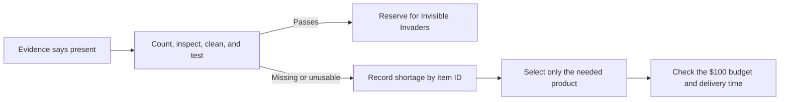

# Camp Materials Inventory Dictionary And Order Check

**Course/project:** EDU486 Integrating Technology in STEM

**Camp team:** Piter Garcia and Aastha, Invisible Invaders

**Inventory review date:** July 14, 2026

**Order budget:** $100 per team

**Live order record:** [Sodus Camp Materials Orders, 2026 GRS tab](https://docs.google.com/spreadsheets/d/1rAuGt8iT-CAx4Oy1cqz_SsVQqqPzi5mE9v7pRCODSAo/edit?gid=1535708448#gid=1535708448)

> **Inventory verdict:** We already have most reusable science, field, technology, access, and advocacy equipment needed for Invisible Invaders. The immediate job is to count, test, clean, and reserve it. Purchases should be limited to depleted consumables or missing contamination-control supplies.

This dictionary combines three evidence sources:

1. 30 local inventory photographs from the July 9 materials tour;
2. the [clean July 9 transcript](../../transcripts/2026-07-09-class-transcript-clean.md), especially the materials tour and sampling demonstration; and
3. the live `2026 GRS` order sheet, where one pound of lab-quality salt is already marked **Ordered** for all camp teams.

The original photographs remain local because several include classmates, instructors, reflections, or course-space details. [The photo evidence index](camp-materials-photo-evidence-index.md) preserves the filename-to-evidence trail without placing identifiable people in the Git repository or participant-facing materials. The [sortable CSV catalog](camp-materials-inventory-catalog.csv) contains the same stable item IDs for later reconciliation with the order sheet.

## How To Read The Status Labels

| Status | Meaning | What we do next |
|---|---|---|
| **PRESENT** | The item is directly visible or explicitly confirmed in class. | Do not buy a duplicate. |
| **CHECK** | At least one is present, but quantity, condition, size, cleanliness, or compatibility is not established. | Count, inspect, test, and reserve. |
| **PREP** | Existing materials can be assembled into what the activity needs. | Make the kit; do not shop first. |
| **GAP** | The activity needs it, but the photo/transcript review did not confirm it. | Check all three storage areas, then consider ordering. |
| **EXCLUDE** | Present or discussed, but unsafe, unnecessary, or inappropriate for camper use in this activity. | Do not place in the camper kit. |

The class used three location codes: **A = LeChase 285 classroom, B = preparation room, C = storage closet**. The photographs do not reliably encode every item's exact room, so locations below remain `A/B/C: confirm` unless the source clearly establishes more.

## 1. Sampling, Containers, And Field Equipment

| ID | Item | Evidence of quantity | Status | Invisible Invaders use | Before camp |
|---|---|---:|---|---|---|
| S01 | Ball/Mason jars | At least 3 complete jars were assigned; roughly 20+ assorted jars are visible | CHECK | Indoor, outdoor, blank, and demonstration samples | Match jars to intact lids; reserve clean sets |
| S02 | Jar lids and rings | Many assorted pieces visible | CHECK | Cover samples together and limit contamination | Match to S01; reject rusted or damaged pieces |
| S03 | Clear storage tubs and lidded bins | Many sizes visible | PRESENT | Carry separate clean and used equipment; accessible station kits | Label one clean-tools bin and one used-tools bin |
| S04 | Beakers, flasks, graduated cylinders, pitchers, and specimen cups | Multiple assorted pieces visible | CHECK | Measuring, transferring, and model demonstrations | Choose non-plastic or contamination-appropriate pieces; inspect for cracks |
| S05 | Porcelain filter funnels | Explicitly demonstrated in class; count not established | CHECK | Hold filter paper over a receiving jar | Count and test fit with selected jars and filters |
| S06 | Metal sieve stack | One multi-size stack visible and demonstrated | PRESENT | Separate sand or debris by size when relevant | Confirm mesh sequence and cleaning procedure |
| S07 | Metal scoops, spoons, and strainers | Several visible and explicitly named | CHECK | Move samples without hand contact | Reserve clean tools by sample; do not cross-contaminate |
| S08 | Buckets and pails | Several plastic and metal buckets visible | PRESENT | Field collection, cleanup, and station organization | Label by purpose; never mix clean-sample and trash buckets |
| S09 | Small field/aquarium nets | At least 2 visible | CHECK | Optional debris or water demonstration | Confirm activity need before reserving |
| S10 | Trash pickers | Several visible | PRESENT | Litter survey and mobility-accessible collection roles | Count, clean handles, and pair with backup tally sheets |
| S11 | Measuring wheel | At least 1 visible | PRESENT | Measure sampling area or source distance | Test wheel and reset counter |
| S12 | Resealable zipper bags | One 100-count box plus additional bags visible | CHECK | Secondary containment and labeled dry materials | Confirm clean, unused stock and sizes |
| S13 | Small red sampling square/tray | Confirmed during class; exact object needs re-identification | CHECK | Mark a defined sample area | Locate and photograph beside a ruler before use |
| S14 | Natural/plastic reference pane and found-plastic samples | Confirmed on class inventory and tour | PRESENT | Compare suspected particles with known examples | Reserve as reference evidence, not as proof of sample identity |
| S15 | Microplastic identification keys/guides | Explicitly described during tour | PRESENT | Distinguish fiber, fragment, film, and foam categories | Put one key at each observation station |
| S16 | Aquarium/tank with substrate | 1 visible | CHECK | Optional movement/settling model only | Clean and use only if it serves a specific activity question |

## 2. Microscopy, Measurement, And Laboratory Equipment

| ID | Item | Evidence of quantity | Status | Invisible Invaders use | Before camp |
|---|---|---:|---|---|---|
| L01 | Compound/dissecting microscopes | At least 4 visible or covered | CHECK | Observe suspected fibers and fragments | Function-test, clean optics, and reserve stations |
| L02 | Microscope camera attachments | Confirmed in class; count not established | CHECK | Project one view so campers do not have to crowd an eyepiece | Test with L01 and compatible computers/software |
| L03 | Microscope slides | Labeled storage and boxes visible | CHECK | Mount tape lifts and filter evidence | Count clean slides; confirm whether coverslips are needed |
| L04 | Filter paper | Labeled storage visible; type and count unclear | CHECK | Filter water or salt-separated samples | Verify diameter, pore/grade, and quantity against protocol |
| L05 | Tweezers/forceps | Labeled storage and several tools visible | CHECK | Move filters and suspected particles | Count enough clean pairs for separate sample stations |
| L06 | Clear crystal/jar tape | Labeled storage and class demonstration | CHECK | Lift particles from dry filter paper to slides | Confirm optical clarity, width, adhesion, and remaining length |
| L07 | Labeling tape | Labeled storage visible | CHECK | Sample IDs, dates, locations, and team labels | Confirm adhesion to selected containers |
| L08 | Balances/scales | Heavy-capacity, precise, and triple-beam options described | CHECK | Measure sample or collected-litter mass | Select one appropriate balance and verify calibration |
| L09 | Rulers | Dedicated drawer labeled | PRESENT | Approximate size and build a scale ladder | Reserve metric rulers |
| L10 | Distilled-water carboy with spigot | 1 large carboy visible | CHECK | Rinsing or protocol water when approved | Confirm contents, cleanliness, and instructor permission |
| L11 | Kimtech delicate-task wipes | At least 5 boxes marked 280 wipes each are visible | PRESENT | Clean equipment and optics as directed | Reserve without treating wipes as sample material |
| L12 | Sink, dish soap, and drying area | 1 lab sink station visible | PRESENT | Handwashing and equipment cleanup | Establish clean-to-dirty workflow |
| L13 | Mini vortex mixers | 2 visible | EXCLUDE | Not required for planned camper investigation | Instructor use only unless protocol changes |
| L14 | Small centrifuge-like devices | 4 visible; identification should be confirmed | EXCLUDE | Not required for planned camper investigation | Do not use without instructor protocol and supervision |
| L15 | Microwave, drying oven, and sterilizer/pressure equipment | Several devices visible | EXCLUDE | Not required for planned camper investigation | Instructor-controlled laboratory equipment only |
| L16 | HOBO/data-logger base stations and sensors | Multiple devices/boxes visible | CHECK | Possible environmental monitoring extension | Use only after model, battery, software, and question are confirmed |

## 3. Technology, Documentation, And Accessible Observation

| ID | Item | Evidence of quantity | Status | Invisible Invaders use | Before camp |
|---|---|---:|---|---|---|
| T01 | University computers/laptops | Several visible and confirmed in class | CHECK | Microscope camera software, shared records, captions, and visual display | Reserve, charge, update, and test required software offline |
| T02 | iPads/tablets | Approximately 7-9 visible in cases | CHECK | Camera view, timer, photo record, non-writing response route | Count working devices and chargers; prepare paper backup |
| T03 | DSLR/still cameras | At least 1 Canon DSLR visible | CHECK | Source mapping and sample documentation | Test battery, memory card, date, and transfer cable |
| T04 | Camcorders/video cameras | Several consumer camcorders visible | CHECK | Pre-recorded explanations and advocacy videos | Test one complete camera/charger/storage kit |
| T05 | Blue USB microphone | 1 boxed unit visible | CHECK | Audio explanation or low-visibility advocacy route | Test recording and playback on T01 |
| T06 | Chargers, batteries, adapters, and device cases | Many visible; matching is unclear | CHECK | Keep technology usable in the field and classroom | Build labeled complete kits; remove unmatched cables |
| T07 | Projector screen | 1 portable screen visible | CHECK | Shared visual model or camera feed | Confirm a working projector/display source separately |
| T08 | Label makers and small printers | Mentioned during tour; exact devices/supplies unclear | CHECK | Large-print labels and visual organization | Locate, test, and confirm tape/ink before planning around them |

## 4. Safety, Access, And Movement Supports

| ID | Item | Evidence of quantity | Status | Invisible Invaders use | Before camp |
|---|---|---:|---|---|---|
| A01 | Safety goggles | Dedicated cabinet/tub confirmed | CHECK | Eye protection for splash-risk procedures | Count clean goggles; inspect straps; confirm fit range |
| A02 | Gloves | Explicitly confirmed during sampling demonstration | CHECK | Short procedures requiring hand protection | Confirm powder-free material, sizes, allergies, and quantity |
| A03 | Lab coats | Large labeled bin visible | CHECK | Clothing protection when appropriate | Confirm material and contamination implications before microplastic work |
| A04 | Boots/waders | Several pairs visible | CHECK | Wet field conditions | Confirm sizes, sanitation, mobility, and actual field need |
| A05 | Rolling carts and hand trucks | Multiple carts visible | PRESENT | Move equipment without requiring heavy carrying | Reserve one stable cart and define a seated coordinator role |
| A06 | Hard equipment cases | At least 2 large cases visible | PRESENT | Protect microscopes/cameras during transport | Verify contents before treating case as available space |
| A07 | Covered station bins | Many lidded tubs visible | PREP | Separate sensory-safe, clean-air, seated, and standard routes | Build equivalent evidence kits rather than separate academic goals |

## 5. Teaching, Modeling, Art, And Advocacy Supplies

| ID | Item | Evidence of quantity | Status | Invisible Invaders use | Before camp |
|---|---|---:|---|---|---|
| C01 | Markers, highlighters, and writing tools | Multiple full bins visible | CHECK | Models, data records, notices/wonders, and advocacy | Remove dried markers; provide thick- and fine-tip choices |
| C02 | Scissors | Labeled drawer/bin and loose pairs visible | CHECK | Cards, models, and art | Count left/right-hand or adaptive options |
| C03 | Post-it notes | Dedicated drawer label; stock not counted | CHECK | Quiet contribution, sorting, and model revision | Confirm colors and quantity; never use color as the only code |
| C04 | Assorted tape | Dedicated bin plus labeled lab tapes | PRESENT | Models, displays, labels, and art | Separate science-clean tape from general craft tape |
| C05 | Glue/adhesives | Mentioned during tour; exact stock unclear | CHECK | Art for advocacy | Confirm non-toxic, low-odor options and quantity |
| C06 | Clipboards | Approximately 12+ visible | PRESENT | Field records, visual schedules, and seated/mobile roles | Reserve by team and attach pencils |
| C07 | Mini whiteboards | Many large and small magnetic boards described and visible | PRESENT | Model revision, sorting, and erasable responses | Count boards, erasers, and working markers |
| C08 | Notebooks and folders | Many visible | PRESENT | Individual records and low-tech backup | Reserve enough for campers and staff |
| C09 | Kraft, colored, and bulletin-paper rolls | Many rolls and cardboard cores visible | PRESENT | Full-size causal models, backdrops, and advocacy displays | Measure usable lengths and reserve accessible work surfaces |
| C10 | Cardboard tubes, cardboard, and recycled construction stock | Many tubes and boxes visible | PRESENT | Model arrows, scale ladder, and recycled art | Inspect edges; prioritize reuse |
| C11 | Poster boards/display panels | Several visible | CHECK | Showcase and image-first explanation | Confirm sizes and mounting method |
| C12 | Laminating pouches | One box labeled 100 pouches, 5 mil, visible | CHECK | Reusable role cards, visual schedule, and source cards | Confirm a working laminator and pouch size |
| C13 | Stickers, badges, trophies, and film clapperboard | Multiple sets visible | PRESENT | Recognition and media/advocacy activities | Use as optional recognition, never competitive access control |
| C14 | STEM identity-category reference poster/materials | 1 reference poster plus class explanation | PRESENT | Help campers name multiple ways of being a STEM person | Confirm bead/badge consumables separately |
| C15 | Books, story resources, and readers-theater materials | Multiple visible and described | PRESENT | Multimodal science/literacy entry points | Select only sources tied to the camp question |

## 6. Invisible Invaders Readiness Crosswalk

| Activity need | Inventory match | Readiness | Decision |
|---|---|---|---|
| Three equivalent indoor, outdoor, and blank sample kits | S01-S03, L05-L07 | **CHECK** | Count and clean matching containers, lids, tweezers, and labels before buying anything |
| Filter-and-slide observation | S05, L01-L07 | **CHECK** | Verify funnels, correct filter paper, slides, clear tape, and at least one camera-equipped microscope station |
| Shared microscope view and non-eyepiece route | L01-L03, T01-T02 | **CHECK** | Test camera/software compatibility and prepare still-image/paper alternatives |
| Location, time, and contamination records | T02-T04, C06-C08 | **PRESENT** | Build one paper and one digital route using the same fields |
| Source mapping and sample-area measurement | S10-S11, T02-T03 | **PRESENT** | Test equipment and prepare a seated mapper/coordinator role |
| Banana/plastic comparison | S01-S02 | **PREP** | Use existing jars; obtain one banana and a documented comparison material close to activity day |
| Air-movement model | C09-C10 | **PREP** | Cut large recoverable pieces; do not release loose powder |
| Human-sample evidence cards | None prepared | **GAP** | Print blood-study, lung-study, and evidence-limit cards plus an environment-only equivalent route |
| Scale ladder, source cards, role cards, and model arrows | C01-C12 | **PREP** | Print/make from existing stock; include image, text, and one-step formats |
| Art for advocacy and showcase | C01-C13 | **PRESENT** | Inventory low-odor adhesives and reserve display surface |
| Plastic-carbon-temperature model | T01-T02 plus climate-model kit not yet inventoried | **CHECK/GAP** | Borrow and pilot two matching probes, two identical heat-safe clear chambers, one guarded lamp, a clear cover, heat-safe mat, and offline PhET route before considering any purchase |
| Gloves and goggles in appropriate sizes | A01-A02 | **CHECK** | Count and fit-check before deciding whether PPE is a purchase |
| Clean covers for samples and field blank | Matching lids may serve; foil not confirmed | **GAP** | Confirm matching lids or clean foil/covers after protocol review |

## 7. Purchase Candidates After Physical Confirmation

These are **not yet approved orders**. They are the only current categories that may justify using the $100 budget after the check-out pass.

| ID | Priority | Candidate | Buy only if... | Why it matters |
|---|---:|---|---|---|
| G01 | 1 | Matching clean sample containers with lids | S01-S02 cannot supply enough identical clean sets | Comparable indoor, outdoor, and blank samples need equivalent containers |
| G02 | 1 | Protocol-matched filter paper | L04 is wrong size/grade or insufficient | The filter must fit the funnel and investigation method |
| G03 | 1 | Clean microscope slides and, if required, coverslips | L03 stock is dirty, chipped, or insufficient | Observation stations need safe, consistent slides |
| G04 | 1 | Powder-free protective gloves in multiple sizes | A02 is insufficient or unsuitable | PPE must fit without introducing avoidable allergy/access barriers |
| G05 | 1 | Clean sample covers or aluminum foil | Matching lids cannot provide equivalent coverage | Samples and the field blank need contamination control |
| G06 | 1 set per group | Human-sample evidence and pathway cards | No complete accessible card set is prepared | The agreed phenomenon requires accurate, calm evidence with visible uncertainty |
| G07 | 2 | Clear optical tape and labeling tape | L06-L07 fail the protocol test or are nearly empty | Tape lifts and durable IDs are central to the evidence trail |
| G08 | 2 | Low-odor non-toxic adhesives | C05 stock is absent, dried, or inaccessible | Advocacy work needs an inclusive sensory-safe route |
| G09 | 2 | Beads, cord, safety pins, or badge blanks | The team adopts the STEM-identity recognition routine and no consumables exist | Recognition should be optional and support multiple identities |

## 8. Do Not Order Or Use Yet

- **Do not order duplicate microscopes, tablets, cameras, clipboards, jars, sieves, buckets, paper, or general art supplies** before the physical check.
- **Do not aerosolize powders or require campers to handle unknown materials.**
- **Do not plan camper use of KOH, unlabeled chemicals, centrifuges, vortex mixers, ovens, microwaves, or sterilization equipment.**
- **Do not assume a photographed device works, has its charger, or is reserved for our team.**
- **Do not call visually identified particles confirmed microplastics.** Record them as suspected fibers or fragments unless a valid polymer-identification method confirms them.
- **Do not use dry ice, sealed gas-producing reactions, UV lamps, burning plastic, or camper-made plastic dust in the temperature model.**

## 9. Physical Check-Out List

Complete this before adding an Amazon link:

- [ ] Count matched clean jars/containers and lids for indoor, outdoor, and blank samples.
- [ ] Count funnels, correct filter papers, clean slides, tweezers, clear tape, and labeling tape.
- [ ] Test at least one microscope camera, computer, and projection/camera-feed route together.
- [ ] Count appropriate gloves and goggles; check sizes, condition, and allergies.
- [ ] Reserve clipboards, metric rulers, a measuring wheel, cameras/tablets, and paper backup forms.
- [ ] Borrow and pilot the plastic-carbon-temperature kit: two matching probes, two identical clear heat-safe chambers, guarded lamp, clear cover, heat-resistant mat, measuring tape, and offline PhET screenshots.
- [ ] Build and label a clean-tools bin, used-tools bin, and low-sensory/seated station kit.
- [ ] Confirm distilled/filtered water and the already ordered lab-quality salt.
- [ ] Locate identification keys and reference samples.
- [ ] Confirm art/display stock, low-odor adhesives, and printing/lamination capacity.
- [ ] Record every shortage by inventory ID before selecting a product.

## 10. Order-Sheet Constraints Already Verified

The live spreadsheet is titled **Sodus Camp Materials Orders**. The target tab is **2026 GRS** (`gid=1535708448`) and uses repeating columns for `Item`, `Quantity`, `Team`, `Amazon Link or other link`, `Status`, and `Notes`.

- `2026 GRS!A6:F6` records the original shared **Lab quality salt**, **1 lb.**, **All Camp**, and **Ordered** entry. It is not an Invisible Invaders request and must remain separate from our team rows.
- The live Team dropdown currently lists `Fibers`, `Plankton to People`, `Getting Small`, `All Camp`, and `Won't arrive in time`.
- **Invisible Invaders is not currently an allowed Team value.** The order uses the validated legacy label `Getting Small` and identifies **Invisible Invaders (Piter + Aastha; sheet label: Getting Small)** in every Notes cell so the team is not obscured.
- The live Status dropdown permits `Ordered`, `Arrived`, `Bring from home`, `Asked Shellie to order`, and `at LeChase Hall`.

The current station setup and under-$100 request are documented in the [Invisible Invaders Camp Operations Guide](../03-camp-unit-plan/invisible-invaders-camp-operations-guide.md) and [sortable budget CSV](invisible-invaders-order-budget.csv). The more expansive predecessor remains available in the [dated archive](archive/2026-07-18-pre-consolidation/invisible-invaders-materials-plan.md).

## AI Use Disclosure

OpenAI Codex was used on July 14, 2026 under Piter Garcia's supervision and guidance to inspect and organize the 30 source photographs, reconcile visible materials with the July 9 transcript and live order sheet, structure the inventory for accessibility, and flag uncertainty instead of inventing exact counts. Piter remains responsible for the physical verification, purchase decisions, and final submission.
