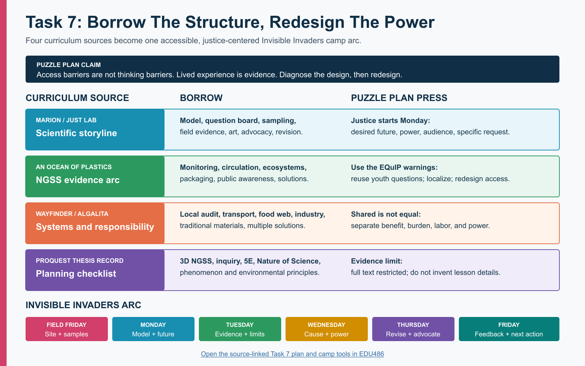

# Task 7 - Curriculum Adaptation And Invisible Invaders Week Plan

**Team:** Piter Garcia and Aastha

**Camp theme:** Invisible Invaders

**Planning lens:** Puzzle Plan / EQUITAS Access-to-Agency STEM

This is our answer to the instruction not to reinvent the wheel. I reviewed the Marion Middle School curriculum and the assigned public curriculum sources to identify what we can reuse, what needs adaptation, and what should not be copied into our camp without stronger evidence, access, and justice design.

[Open the full-size visual](../../public-artifacts/task7-curriculum-to-camp-map.png) | [Open the camp-ready tools](task7-camp-tools.md) | [Open the camp-folder index](invisible-invaders-camp-folder-index.md)

## What Counts As Completed

- The four assigned curriculum sources have been explored with their access limits documented.
- Reusable activities have been connected to the Invisible Invaders phenomenon instead of copied as an unrelated ocean-plastics unit.
- The two gaps named by the instructors now have concrete design responses: youth identify the future they want, and they examine power, burden, responsibility, decision-making, and justice before choosing an advocacy action.
- The collective Field Friday and the team's Monday-Friday responsibilities have a coherent learning arc.
- Initial modeling begins Monday, model revision occurs before Thursday's showcase, and Friday preserves community response and next action.
- Camp materials, protocols, media, activity plans, and still-needed handouts are organized in one index.
- The co-leader research conversation is prepared, but Piter and Aastha still need to make the final decision together.

## Puzzle Plan Design Commitments

1. **Access barriers are not thinking barriers.** Every core investigation has equivalent observation, recording, explanation, movement, energy, language, sensory, and technology routes.
2. **Lived experience and community knowledge are evidence.** Youth may connect traffic, clothing, cleaning, buildings, water, work, culture, health, and neighborhood observations to the model without being forced to disclose private information.
3. **Evidence must reveal thinking.** We evaluate causal reasoning, use of evidence, uncertainty, and revision separately from handwriting, reading speed, speech fluency, stamina, English dominance, or media polish.
4. **Technology is judged by agency.** A microscope camera, shared image, audio recorder, captioned video, or digital map earns a place only when it expands who can notice, contribute, compare, revise, or communicate.
5. **Diagnose the design before blaming the learner.** When participation breaks down, we examine the task, tool, pace, roles, language, sensory conditions, and group power before interpreting the learner as disengaged or unable.
6. **Multiple identities interact.** Neurodivergence, chronic illness, disability, race, culture, language, trauma, class, gender, and community position can shape both exposure and whose knowledge is recognized.
7. **Justice includes joy and transformation.** Art, humor, curiosity, choice, movement, belonging, and public purpose are part of rigorous science, not rewards after the real work.

## Curriculum Evidence Audit

### JuST Lab / Marion Middle School

**Reviewed:** The full main unit through the [connected course Google Doc](https://docs.google.com/document/d/1LJGPe-S99d1vuIUEIi17UZgid6NJyhd4UI7c9g5qYfY/edit?tab=t.0#heading=h.7nuolonm853y).

**Borrow:** Anchoring phenomenon, initial model, question board, sampling, microscopy, field data, social media, trash art, advocacy planning, data analysis, model revision, and showcase.

**Puzzle Plan pressure:** Youth advocacy appears late and can remain generic. Power, unequal burden, decision-makers, and the future youth want are not consistently built into the evidence arc.

**Decision:** Reuse the scientific storyline; redesign justice and advocacy throughout.

### An Ocean Of Plastics

**Reviewed:** The [official NGSS listing](https://www.nextgenscience.org/resources/middle-school-aspire-public-schools-ocean-plastics) and [EQuIP review](https://www.nextgenscience.org/sites/default/files/NGSS%20EQuIP%20Unit%20feedback%20form_An%20Ocean%20of%20Plastics_Consensus.pdf). The listing identifies a 2017 draft unit and notes broken or missing linked materials.

**Borrow:** Local waste monitoring, data displays, water and ocean circulation, ecosystem effects, packaging redesign, public awareness, and family/community communication.

**Puzzle Plan pressure:** The official review says student questions are not consistently reused, differentiation is underdeveloped, the California context needs localization, and more student control is needed.

**Decision:** Borrow selected routines, not the whole 15-lesson sequence.

### Algalita / Wayfinder Plastic Ocean Guide

**Reviewed:** The [official 2023 guide](https://algalita.org/wayfinder-society/guide/ngss-ms-ess-3-3-plastic-ocean-human-impact/) and linked lesson descriptions.

**Borrow:** Campus audit, local-to-global transport, food-web modeling, responsibility debate, industry responsibility, traditional/local materials, and multiple solution types.

**Puzzle Plan pressure:** Shared responsibility cannot be presented as equal responsibility. Cultural knowledge must be engaged respectfully rather than treated as a decorative alternative-materials activity.

**Decision:** Use the responsibility and systems frame to strengthen Marion.

### Seventh-Grade NGSS Unit Record

**Reviewed:** The [ProQuest record](https://www.proquest.com/dissertations-theses/development-7-sup-th-grade-ngss-based-unit/docview/2600793823/se-2) and public index-level information only. The full text was not available in this review.

**Borrow:** A planning checklist connecting three-dimensional NGSS, California environmental principles, inquiry, 5E, Nature of Science, and phenomenon-based learning.

**Puzzle Plan pressure:** Restricted access means I cannot claim its activities were reviewed or copy details that were not visible.

**Decision:** Keep as a follow-up source; do not treat it as an activity bank yet.

## 1. Marion Middle School: Keep The Spine, Add The Missing Justice Links

### Keep

- Start with a provocative microplastics phenomenon, then ask youth to model how particles reached the observed place.
- Preserve a visible question board and model history so youth can see how the investigation changes the shared explanation.
- Use local sampling, blanks, classification, microscopy, data analysis, public communication, trash art, and model revision.
- Keep the movement from evidence to advocacy rather than ending with identification alone.

### Modify

- Record visually identified particles as **suspected microplastics** unless polymer testing confirms them.
- Replace a generic social-media post with an audience decision: who needs to understand this, what can they decide, and what evidence will matter to them?
- Introduce justice on Monday, not after the scientific work is finished. Each day's navigation record includes: who benefits, who bears risk or cleanup labor, who has alternatives, who decides, and whose knowledge is missing.
- Add a **Future We Want** board before youth choose solutions. Campers identify what they want to stop, start, protect, repair, or redesign.
- Require every advocacy product to name an evidence-supported request, a decision-maker, and a safeguard against shifting cost or blame onto families with the fewest choices.

### Do Not Copy Without Revision

- Do not treat visual sorting as chemical identification.
- Do not make outdoor collection, microscope eyepieces, handwriting, fast group speech, or public presentation the only routes to rigorous participation.
- Do not imply that all people cause or can solve plastic pollution equally.
- Do not ask youth to perform disability, health, trauma, culture, or poverty for the lesson to feel relevant.

## 2. An Ocean Of Plastics: Use The Review, Not Just The Activities

The unit's strongest reusable pattern is a long arc from a visible problem to monitoring, circulation, ecosystem effects, packaging, and public action. The official EQuIP feedback is equally useful because it identifies problems we can prevent: student questions can disappear after lesson one, local relevance can be assumed, teacher direction can overpower student input, formative evidence can be collected without changing instruction, and differentiation can remain an unsupported suggestion.

### Invisible Invaders Adaptation

- Use our parking-lot, classroom, field blank, sand, and water evidence as the local anchor instead of importing a California ocean context.
- Return to the question board after every investigation and mark which youth questions changed the plan, which remain open, and which cannot be answered with our current evidence.
- Use one shared evidence standard across paper, image, model, oral, audio, home-language, and partner-supported routes.
- Treat formative evidence as a redesign signal: if a route hides thinking, change the route or support before lowering the intellectual goal.
- Borrow packaging or product redesign only if youth evidence leads there; do not force a predetermined individual-consumption solution.

## 3. Wayfinder: Make Responsibility A Scientific And Justice Question

The Wayfinder sequence moves from a [campus cleanup](https://algalita.org/wayfinder-society/lesson/campus-cleanup/) to [currents and gyres](https://algalita.org/wayfinder-society/lesson/currents-and-gyres-plastics-and-global-circulation/), [food-web effects](https://algalita.org/wayfinder-society/lesson/biomagnification-in-the-marine-food-web/), [shipping responsibility](https://algalita.org/wayfinder-society/lesson/shipping-container-spills-who-is-responsible/), and [traditional materials](https://algalita.org/wayfinder-society/lesson/examining-traditional-materials-as-solutions-to-overuse-of-plastic/). We do not need all five lessons, but the sequence helps us connect a local observation to transport, systems, responsibility, and solutions.

### Invisible Invaders Adaptation

- Borrow the hotspot map for Field Friday and add indoor/outdoor source-pathway mapping.
- Borrow responsibility analysis, but separate **contribution, benefit, exposure, cleanup labor, decision power, and access to alternatives** instead of saying everyone is equally responsible.
- Use multiple solution levels: personal practice, school operations, product design, industry responsibility, infrastructure, monitoring, and policy.
- Invite local and cultural material knowledge as expertise with source credit and context. Do not ask youth to represent a culture or reduce traditional knowledge to a replacement-material craft.
- Let youth decide which solution level matches their evidence and audience.

## 4. ProQuest Unit: Use As A Planning Check, Not An Unseen Curriculum

The accessible record identifies a seventh-grade NGSS-based plastics unit, but the complete thesis was not available during this review. I can responsibly use the visible design categories as a planning check: three-dimensional NGSS, environmental principles, inquiry, 5E, Nature of Science, and an anchoring phenomenon. I cannot responsibly summarize its lesson sequence, access supports, justice framing, or results without the full source.

**Follow-up:** Use University of Rochester library access to retrieve the full thesis before borrowing any activity attributed specifically to it.

## The Missing Marion Addition: From Evidence To A More Just Future

This sequence begins Monday and stays visible all week.

1. **Future:** What do we want indoor, outdoor, school, water, and community environments to be like?
2. **Pattern:** What does our evidence suggest, and what can it not establish?
3. **Power:** Who produces, sells, chooses, regulates, maintains, cleans, monitors, benefits, and bears exposure?
4. **Possibility:** Which changes are available at personal, school, industry, infrastructure, and policy levels?
5. **Decision:** Who can make the change we seek, and what evidence would they need?
6. **Request:** What specific action are we asking for?
7. **Justice check:** Could our request create new cost, surveillance, shame, inaccessible work, or unequal burden?
8. **Public meaning:** How will art, data, a model, and youth voice help the audience understand both the evidence and the desired future?

The [camp-ready tools packet](task7-camp-tools.md) contains the corresponding youth-facing prompts.

## Questions Piter And Aastha Need To Decide Together

### Proposed Instructional Question

> How can suspected microplastic particles reach and remain in indoor and outdoor spaces, what can our samples support, and what should change?

### Proposed Learning-Sciences Research Question

> How do visible navigation routines and multimodal participation pathways affect whose observations, questions, and model revisions shape the group's scientific explanation and advocacy?

### Decisions For The Co-Leader Conversation

- Confirm or revise the research question without treating it as data collection about diagnoses.
- Choose the Field Friday sites and the indoor/outdoor comparison that will remain central during camp.
- Decide what participation evidence can be gathered ethically: contribution route, role access, idea uptake, model revision, and optional anonymous feedback.
- Choose the Thursday showcase audience and one or more realistic decision-makers.
- Decide how facilitation, preparation, sensory access, equipment, and documentation labor will be shared.
- Confirm which youth decisions can genuinely change the plan so we do not create pseudoagency.

## Field Launch Friday: Shared Evidence And Community Context

**Purpose:** Collect water, sand, macroplastic, location, and pathway evidence that can anchor the next week's modeling and advocacy.

**Before collection:** Youth and leaders compare possible sites for relevance, safety, access, likely sources, water/sand conditions, and the community question each site can help answer. Record why each site was chosen; convenience alone is not a scientific rationale.

**Equivalent roles:** site mapper, photographer, sample labeler, clean-tools monitor, timer, recorder, seated coordinator, social-media image selector, art-material sorter, and sample collector. No single role owns the science.

**Collect:** water, sand, visible litter, field blanks, source/pathway photographs, access observations, and field notes. Follow the [sampling protocol](https://docs.google.com/document/d/1HP06TOL2cnycQSgDcRfV57cEUYHuwoHTmVGRABv9tys/edit).

**Communicate:** Draft image-led social posts that state what was sampled, why the site matters, and what remains unknown. Do not claim a particle is plastic before the evidence supports that label.

**Art preparation:** Retain only safe, cleanable materials approved for art. Photograph unsafe or contaminated objects instead of bringing them into camp.

## Camp Week Monday-Friday

### Monday - Notice, Model, And Name The Future

**Driving question:** How could suspected particles reach both a parking lot and a classroom?

**Core work:** Examine field images and selected samples; compare banana/plastic change and the scale ladder; build an initial model; create a multimodal question board; begin the Future We Want board.

**Justice and identity:** Invite community, building, traffic, clothing, work, health, culture, and neighborhood knowledge without requiring personal disclosure. Ask whose experiences or observations are missing.

**Evidence produced:** Initial model, notices and wonders, question clusters, desired-future statements, and questions selected for investigation.

**Access:** Image, object, text, audio, drawing, home-language, dictated, private, partner, seated, low-energy, and movement routes.

### Tuesday - Compare Evidence And Protect Uncertainty

**Driving question:** What patterns appear across indoor, outdoor, field, and blank evidence?

**Core work:** Use matched stations to filter or observe samples; classify suspected fibers/fragments; compare sample and blank records; use still images when direct microscope viewing is inaccessible; document contamination concerns.

**Justice and identity:** Ask who has access to monitoring tools, clean environments, maintenance resources, and institutional response. Do not interpret exposure or clothing choices as personal fault.

**Evidence produced:** Shared tally, observation images/drawings, comparison statement, evidence-limit note, and navigation update.

**Access:** Eyepiece, camera feed, enlarged still image, partner description, paper tally, typed form, dictation, pointing, or sorting-card routes.

### Wednesday - Build The Causal Explanation And Map Power

**Driving question:** Which sources and transport pathways could explain our observations, and who can influence them?

**Core work:** Add source, release, transport, settling, sampling, and uncertainty links to the model; compare direct sources; complete the justice-and-power map; examine solutions at several system levels.

**Justice and identity:** Separate contribution from control. Map who benefits, who bears exposure or cleanup labor, who has alternatives, who decides, and whose evidence is treated as credible.

**Evidence produced:** Causal-chain model draft, source notes, power map, and two evidence-supported solution possibilities.

**Access:** Moveable cards, large diagram, text, audio, collaborative model, quiet research route, preselected short sources, and captioned/offline media.

### Thursday - Revise, Advocate, Create, And Showcase

**Driving question:** What changed in our explanation, and what do we want a real audience to do?

**Core work:** Revise the Monday model; compare before/after reasoning; choose a decision-maker; complete an evidence-to-action planner; create advocacy art plus an image-led poster, captioned video, audio message, live explanation, or partner-supported presentation.

**Justice and identity:** Check whether the request shifts cost, blame, surveillance, or labor onto youth, disabled people, workers, or families with fewer choices. Credit youth and community knowledge that changed the explanation.

**Evidence produced:** Revised model, claim-evidence-warrant, uncertainty statement, specific request, art message, and showcase product.

**Access:** Campers choose medium, language, audience visibility, live or prerecorded contribution, individual or shared authorship, and presentation role. Scientific reasoning is evaluated separately from production polish.

### Friday - Listen, Reflect, And Continue The Action

**Driving question:** What did our audience understand or challenge, and what should happen next?

**Core work:** Sort audience feedback into understanding, questions, commitments, and concerns; revise the action request if needed; document what the evidence still cannot answer; identify one realistic next step and one longer-term question.

**Justice and identity:** Ask whose feedback carries institutional power, whose response was missing, and how youth retain authorship after the showcase. Do not treat public visibility as the only measure of impact.

**Evidence produced:** Feedback map, final reflection in a chosen mode, revised request, next-action owner, and open-question record.

**Access:** Anonymous response, audio, drawing, conversation, text, home language, private reflection, partner support, and opt-in public attribution.

## Evidence We Will Collect Without Ranking Communication Modes

- first and revised models;
- question-board contributions and records of which ideas changed the plan;
- sample, blank, image, tally, and contamination notes;
- source-pathway reasoning and evidence limits;
- justice-and-power map;
- evidence-to-action planner;
- art or communication product;
- audience feedback and final reflection.

The same scientific criteria apply across modes: causal coherence, evidence use, uncertainty, revision, systems reasoning, and an action that fits the evidence.

## NGSS Connections

- **MS-ESS3-3:** apply scientific principles to design a method for monitoring and minimizing human impact on the environment.
- **MS-ESS2-6:** use models of circulation when explaining how materials can move across connected systems.
- **MS-LS2-4:** use evidence to reason about how environmental changes can affect populations when food-web impacts become relevant.
- **Science and Engineering Practices:** asking questions, planning investigations, analyzing data, developing models, arguing from evidence, and communicating information.
- **Crosscutting Concepts:** cause and effect; systems and system models; scale, proportion, and quantity; stability and change.

## Materials And Activity Organization

Use the [Invisible Invaders camp-folder index](invisible-invaders-camp-folder-index.md) as the front door. It connects the shared Drive files to the local activity plan, gapless explanation, protocols, media, visuals, material inventory, order budget, and printable Task 7 tools.

## AI Use Disclosure

I used OpenAI Codex on July 14, 2026 under my supervision to help organize and compare the curriculum sources, structure the Monday-Friday sequence, create the visual and youth-facing tools, test the plan for missing causal and justice links, and make the materials easier to access in multiple formats. I provided and guided the Puzzle Plan claims, course context, Invisible Invaders purpose, inclusion requirements, and final direction. I reviewed the content and remain responsible for the scientific, ethical, access, and submission decisions.
