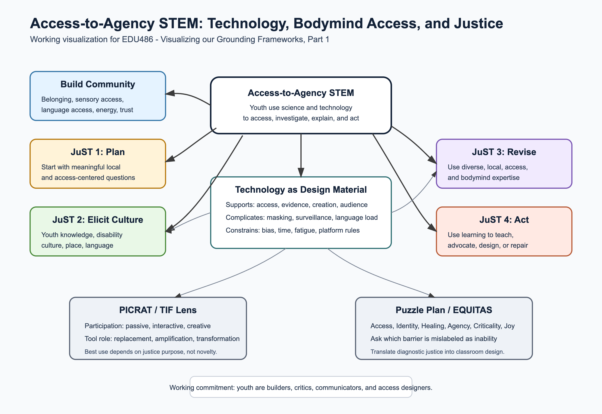
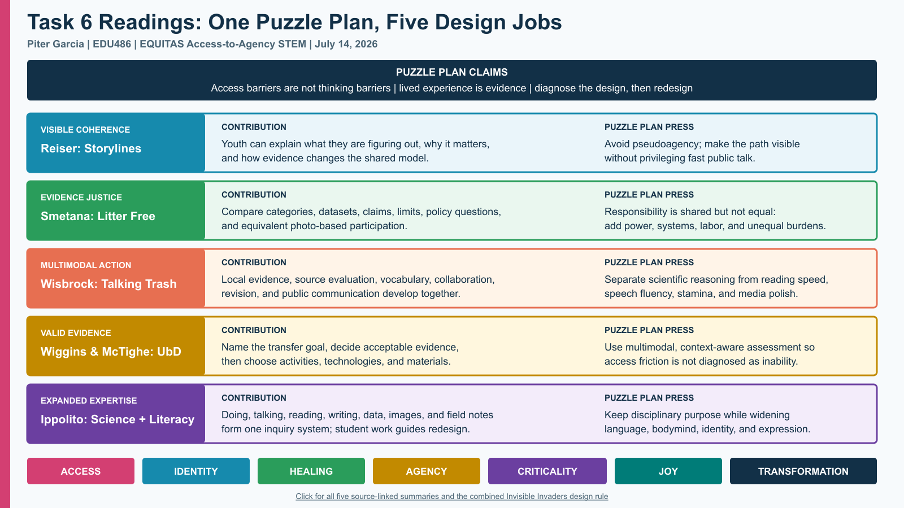
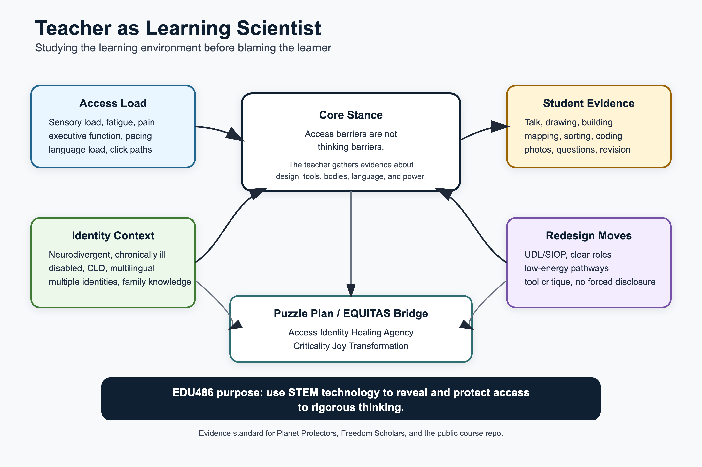
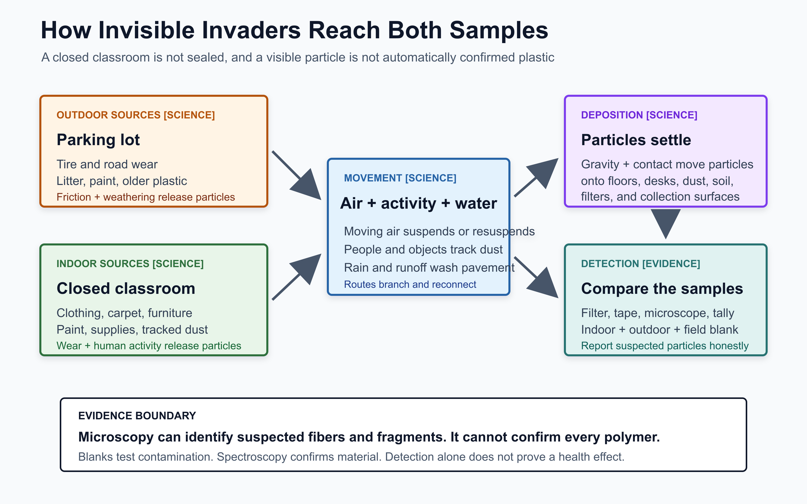
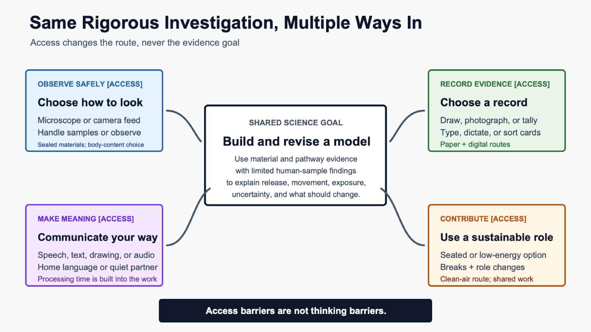
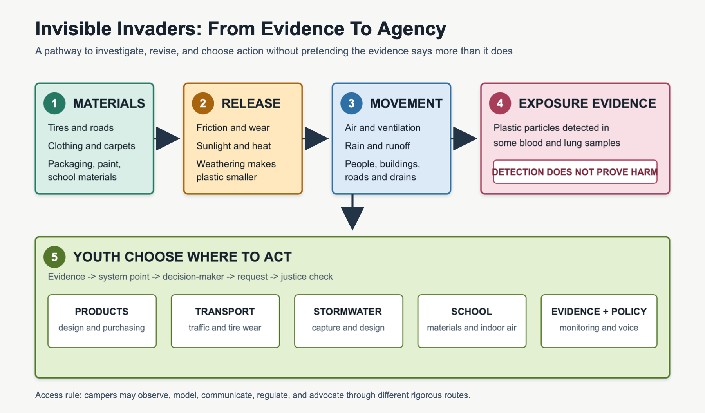

# Public Visual Artifacts

These are GitHub-safe generated visuals made from original course work. They replace the earlier generic image with purpose-built artifacts grounded in Puzzle Plan / EQUITAS, neurodivergent access, chronic illness access, CLD/multilingual access, and multiple identities.

- [Teacher as learning scientist evidence map, SVG](teacher-learning-scientist-evidence-map.svg)
- [Teacher as learning scientist evidence map, PNG](teacher-learning-scientist-evidence-map.png)
- [Grounding frameworks visual, SVG](../assignments/01-grounding-frameworks/grounding-frameworks-visual.svg)
- [Grounding frameworks visual, PNG](grounding-frameworks-visual.png)
- [Task 6 Puzzle Plan reading map, SVG](session5-puzzle-plan-reading-map.svg)
- [Task 6 Puzzle Plan reading map, PNG](session5-puzzle-plan-reading-map.png)
- [Task 7 curriculum-to-camp map, SVG](task7-curriculum-to-camp-map.svg)
- [Task 7 curriculum-to-camp map, PNG](task7-curriculum-to-camp-map.png)
- [Invisible Invaders causal pathway, SVG](../assignments/05-july14-camp-prep/invisible-invaders-causal-chain.svg)
- [Invisible Invaders causal pathway, PNG](invisible-invaders-causal-chain.png)
- [Invisible Invaders access pathways, SVG](../assignments/05-july14-camp-prep/invisible-invaders-access-pathways.svg)
- [Invisible Invaders access pathways, PNG](invisible-invaders-access-pathways.png)
- [Invisible Invaders evidence-to-agency map, SVG](../assignments/05-july14-camp-prep/invisible-invaders-evidence-to-agency-map.svg)
- [Invisible Invaders evidence-to-agency map, PNG](invisible-invaders-evidence-to-agency-map.png)
- [Youth STEM story slide 1](youth-stem-access-slide-1.png)
- [Youth STEM story slide 2](youth-stem-access-slide-2.png)
- [Youth STEM story slide 3](youth-stem-access-slide-3.png)
- [Youth STEM story slide 4](youth-stem-access-slide-4.png)

## Preview

